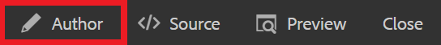

# Crear un mapa

Un mapa es una herramienta organizativa que permite añadir y organizar la información en una estructura jerárquica. Estas tareas le muestran cómo crear un mapa y organizar el contenido en el mapa.

Puede descargar archivos DITA de ejemplo desde aquí:

* [Documents-with-Visual-Content.dita](assets/working-with-maps/Documents-with-Visual-Content.dita)
* [Trabajo con Tables.dita](assets/working-with-maps/Working-with-Tables.dita)

>[!VIDEO](https://video.tv.adobe.com/v/336725?quality=12&learn=on)

## Cargar componentes de mapa

Si lo desea, puede cargar archivos de muestra locales en AEM para obtener un conjunto de materiales más completo.

1. Arrastre y suelte los archivos locales en AEM para cargarlos.
1. Repita el proceso según sea necesario para cualquier archivo, incluidas imágenes y temas.

## Creación de un mapa

1. Para abrir el [!UICONTROL Opciones] seleccione el icono de elipsis en la carpeta principal .

   

1. Select **[!UICONTROL Crear]** > **[!UICONTROL Mapa]**.

   

   La variable [!UICONTROL Crear nuevo mapa] se abre.

1. En el [!UICONTROL Plantilla] campo, seleccione **[!UICONTROL Bookmap]** en el menú desplegable y asigne un título a la asignación.
1. Seleccione **[!UICONTROL Crear]**.

   Se crea el mapa y el carril izquierdo cambia automáticamente de la vista Repositorio a la vista Mapa.

## Insertar componentes de mapa

1. Seleccione el icono de lápiz en el carril izquierdo.

   

   Este es el icono Editar y le permite abrir el mapa en el editor.

1. Vuelva a la vista Repositorio seleccionando el icono Repositorio .

   

1. Añada un tema al mapa arrastrándolo y soltándolo desde el Repositorio en el mapa del editor.

   El indicador de línea le muestra dónde se coloca el tema.

1. Siga agregando temas según sea necesario.

## Ver una vista previa del mapa

La vista previa proporciona una vista rápida del contenido utilizando los formatos predeterminados. Muestra los encabezados, párrafos, listas y cualquier otro contenido de los temas que se muestre.

1. Select **[!UICONTROL Vista previa]** en la barra de menús superior negra.

   

El contenido se abre en [!UICONTROL Vista previa].

1. Para volver a la vista de autor y reanudar la edición de mapas, seleccione **Autor.**

   

## Configuración de la estructura del mapa

Puede editar la jerarquía de temas dentro del mapa.

1. Haga clic en el icono de un tema para seleccionarlo.
2. Utilice las flechas para degradar y promocionar elementos respectivamente.

   

## Guardar el mapa como una nueva versión

Una vez completado el mapa, puede guardar su trabajo como una nueva versión y registrar sus cambios.

1. Seleccione el **[!UICONTROL Guardar como nueva versión]** icono.

   

1. En el campo Comentarios para nueva versión , introduzca un resumen breve pero claro de los cambios.

1. En el campo Rótulos de versión , introduzca las etiquetas relevantes.

   Las etiquetas le permiten especificar la versión que desea incluir al publicar.

   >[!NOTE]
   > 
   > Si el programa está configurado con etiquetas predefinidas, puede seleccionarlas para garantizar un etiquetado coherente.

1. Seleccione **Guardar**.

   Ha creado una nueva versión del mapa y se actualiza el número de versión.
