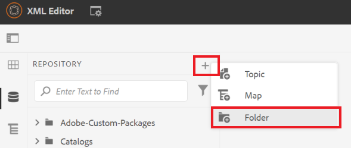
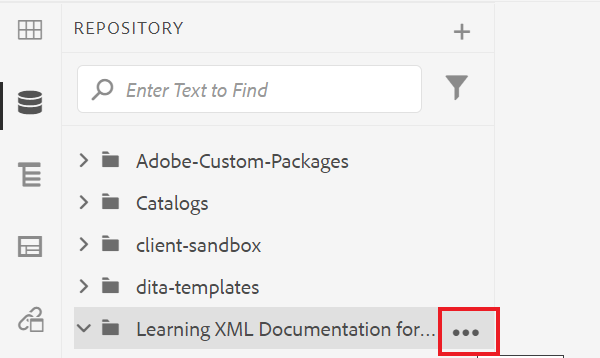
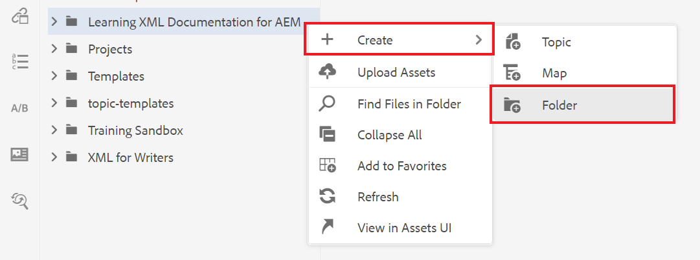
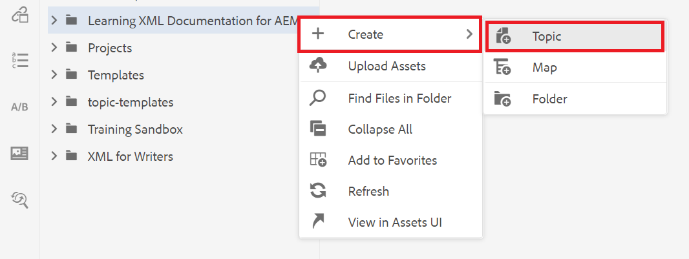
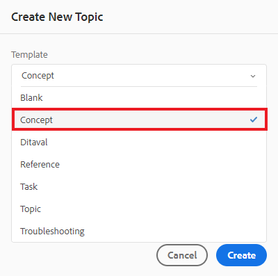

# Creación y estructuración de contenido

Una vez que se haya familiarizado con la interfaz de usuario, puede empezar a crear y estructurar su propio contenido.

>[!VIDEO](https://video.tv.adobe.com/v/336657?quality=12&learn=on)

## Creación de una carpeta

1. Seleccione el **Repositorio** para ver sus carpetas y archivos.

   

1. Seleccione el **+** y **Carpeta**.

   
1. Asigne un título a la carpeta.
1. Seleccione **Crear**.
Ha creado una carpeta nueva que ahora se muestra en el Repositorio. Esta carpeta es su hogar para todo el contenido del curso.

## Creación de una subcarpeta

Ahora podemos crear una carpeta dentro de la nueva carpeta para que contenga imágenes u otro contenido.

1. Pase el ratón sobre la nueva carpeta en el Repositorio y seleccione el icono de elipsis que se muestra.

   

   Se muestra el menú Opciones.
1. Select **Crear \> Carpeta**.
   

1. Asigne un título a la subcarpeta (por ejemplo, &quot;imágenes&quot;) y seleccione **Crear**.

## Creación y rellenado de un nuevo concepto

1. Pase el ratón sobre la carpeta principal en el Repositorio y seleccione el icono de elipsis.

   

   Se muestra el menú Opciones.
1. Select **Crear \> Tema**.

   

   Aparece el cuadro de diálogo Crear nuevo tema .

1. En el menú desplegable Plantilla del cuadro de diálogo, seleccione **Concepto**.

   

1. Asigne un título al concepto y seleccione **Crear**.

   El nuevo concepto se muestra en el editor, rellenado con su título.

   

1. Rellene el concepto haciendo clic en la descripción breve o en el párrafo y escribiendo el contenido.

## Guardar y guardar como nueva versión

Puede guardar el trabajo en cualquier momento con Guardar o Guardar como nueva versión. Utilice Guardar para conservar los cambios y Guardar como nueva versión para crear una nueva versión del tema con los cambios actuales.

### Guardar su trabajo sin versiones

1. Seleccione el **Guardar** icono.

   

### Guardar como una nueva versión

1. Seleccione el **Guardar como nueva versión** a la derecha del icono Guardar .

   

   Aparece el cuadro de diálogo Guardar como nueva versión .

1. En el campo Comentarios para nueva versión , introduzca un resumen breve pero claro de los cambios.
1. En el campo Rótulos de versión , introduzca las etiquetas relevantes.

   Las etiquetas le permiten especificar la versión que desea incluir al publicar.

   >[!NOTE]
   > 
   > Si el programa está configurado con etiquetas predefinidas, puede seleccionarlas para garantizar un etiquetado coherente.
1. Seleccione **Guardar**.

   Ha creado una nueva versión del tema y se actualiza el número de versión.
