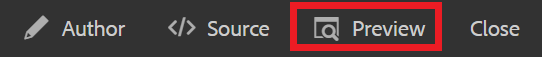

# Vinculación a sitios web

Los vínculos web dirigen a los lectores a los sitios web para obtener más información, permitirles interactuar con contenido externo o dar acceso a archivos descargables. Los siguientes pasos explican cómo añadir un vínculo web a un concepto existente.

>[!VIDEO](https://video.tv.adobe.com/v/336656?quality=12&learn=on)

## Inserción de un vínculo

1. Seleccione el concepto en el Repositorio y ábralo en el editor.
2. Añada una cadena de texto al concepto y resalte o resalte el texto de su elección existente.

   El texto resaltado es donde se insertará el vínculo.
3. Seleccione el **Insertar referencia cruzada** de la barra de herramientas.

   

   Se muestra el cuadro de diálogo Referencia.

4. Select **Vínculo web** en el menú de la izquierda.
5. Pegue la dirección URL que desee y haga clic en **Select**.

   El vínculo funciona y abre una página web en una nueva ficha del explorador cuando se hace clic en él.

## Uso de la vista previa para probar vínculos

El botón Vista previa permite ver una vista previa de un tema. Aquí puede probar los vínculos y verlos como haría su audiencia.

1. Select **Vista previa** en la barra de menús superior negra.

   

   El concepto se abre en Vista previa.

1. Seleccione el vínculo .
El destino del vínculo se abre en otra pestaña.
1. Volver a la vista Autor seleccionando **Autor** en la barra de menús superior negra.

   

## Guardar como una nueva versión

Ahora que ha añadido más contenido al concepto, puede guardar el trabajo como una nueva versión y registrar los cambios.

1. Seleccione el **Guardar como nueva versión** icono.

   

1. En el campo Comentarios para nueva versión , introduzca un resumen breve pero claro de los cambios.
1. En el campo Rótulos de versión , introduzca las etiquetas relevantes.

   Las etiquetas le permiten especificar la versión que desea incluir al publicar.

   >[!NOTE]
   > 
   > Si el programa está configurado con etiquetas predefinidas, puede seleccionarlas para garantizar un etiquetado coherente.

1. Seleccione **Guardar**.

   Ha creado una nueva versión del tema y se actualiza el número de versión.
