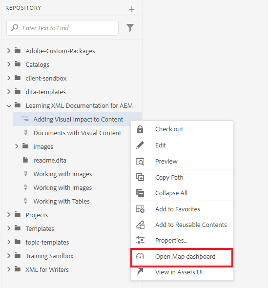
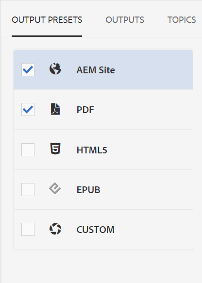
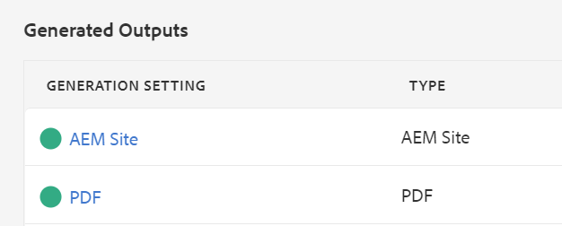

# Publicar salida predeterminada

Una vez que haya completado un mapa, puede publicar el contenido en varios formatos de salida.

>[!VIDEO](https://video.tv.adobe.com/v/336662?quality=12&learn=on)

## AEM Publicación de su mapa como sitio de y PDF

Hay una serie de ajustes preestablecidos de salida disponibles para que pueda elegir. AEM Esta guía se centrará en los resultados del sitio de la y del PDF.

1. En el repositorio, seleccione el icono de puntos suspensivos del mapa para abrir el menú Opciones y, a continuación, **Abra en el tablero de mapas.**

   

   El tablero de mapas se abre en otra pestaña.

1. AEM En la pestaña Ajustes preestablecidos de salida, seleccione Sitio y PDF de la selección, respectivamente.

   

1. Seleccionar **Generar.**

1. Vaya a la página Resultados para ver el estado de los resultados generados.

   Un círculo verde indica que la generación ha finalizado.

   

## AEM Salida del sitio de

AEM AEM En el resultado del sitio de la, los temas, listas, imágenes, títulos, tablas y otro contenido creado con el Editor XML se publican automáticamente en el contenido compatible con la Web por parte de los usuarios de forma que puedan acceder a él desde cualquier sitio web.

Puede ver los temas subordinados en la tabla de contenido así como en la sección Información relacionada. Todos estos vínculos se pueden utilizar para navegar.

## La salida del PDF

El documento de PDF terminado contiene el título predeterminado del mapa como título principal de la portada. Las portadas de los capítulos llevan el estilo del número de capítulo y contienen vínculos a los temas incluidos en.
