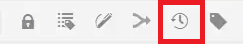
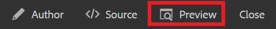

# Versiones de contenido

Al generar una versión de un documento, se crea una instantánea de su estado actual. La creación de varias versiones de un tema o mapa le permite realizar un seguimiento de los cambios y recuperar trabajos antiguos.

>[!VIDEO](https://video.tv.adobe.com/v/336724?quality=12&learn=on)

## Creación de una nueva versión

1. Seleccione el icono Guardar como nueva versión .

   

   Aparece el cuadro de diálogo Guardar como nueva versión .

1. En el campo Comentarios para nueva versión , introduzca un resumen breve pero claro de los cambios.
1. En el campo Rótulos de versión , introduzca las etiquetas relevantes.

   Las etiquetas le permiten especificar la versión que desea incluir al publicar.

   >[!NOTE]
   >
   >Si el programa está configurado con etiquetas predefinidas, puede seleccionarlas para garantizar un etiquetado coherente.

1. Seleccione **Guardar**.

   Ha creado una nueva versión del tema y se actualiza el número de versión. La primera versión de un documento será la versión 1.0.

## Visualización del historial de versiones

Una vez que tenga varias versiones del contenido, es posible que desee explorar las diferencias entre ellas.

1. Seleccione el icono Historial de versiones en la barra de herramientas.

   

   Aparece el cuadro de diálogo Historial de versiones .

1. Seleccione una versión de la lista desplegable para comparar su versión actual con.

   Se indican los cambios de versión a versión.

## Revertir a una versión seleccionada

Si es necesario, puede seleccionar una versión y volver a ella. Esto le permite descartar la versión actual y volver a trabajar con una anterior.

1. En el cuadro de diálogo Historial de versiones, seleccione la versión a la que desee revertir en la lista desplegable.
1. Select **Revertir a la versión seleccionada**.

Aparece el cuadro de diálogo Revertir versión .

1. Añada un comentario descriptivo sobre por qué está revertiendo a una versión anterior.
1. Select **Confirmar**.

   El tema ha vuelto a la versión específica.

## Uso de filtros para comparar versiones

También puede ver las diferencias de versión en Vista previa utilizando los filtros Tracking y Show Diff en el carril derecho.

1. Select **Vista previa** en la barra de menús superior.

   

   El tema se abre en Vista previa.

1. En la lista desplegable Seguimiento del carril derecho, seleccione **Mostrar marcado**.
1. En la lista desplegable Mostrar diferencia , seleccione la versión con la que desee comparar.

   Los cambios se muestran como contenido con formato.
