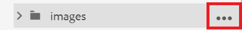
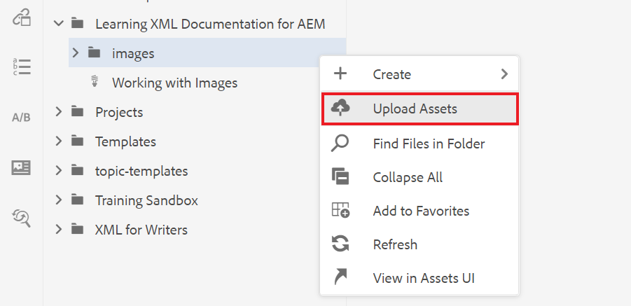
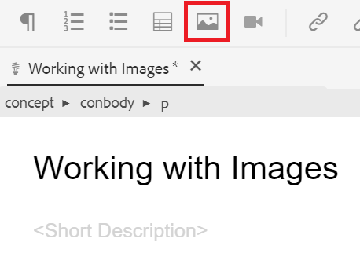
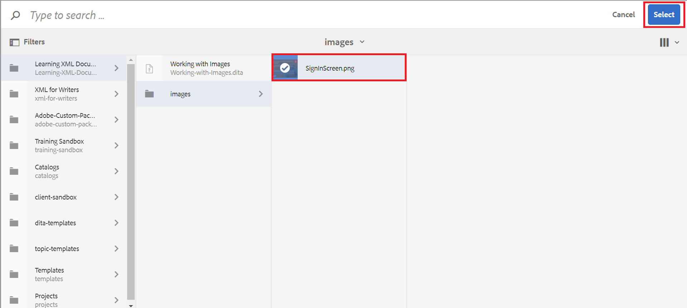

# Uso de imágenes

A continuación se muestra cómo cargar e insertar una imagen, así como cómo guardar una nueva versión de un tema.

Puede descargar el archivo de imagen de ejemplo desde [aquí.](assets/working-with-images/SignInScreen.png)

>[!VIDEO](https://video.tv.adobe.com/v/336661?quality=12&learn=on)

## Carga de una imagen

1. Pase el ratón sobre la subcarpeta y seleccione el icono de elipsis para abrir el menú Opciones .

   

1. Select **[!UICONTROL Cargar recursos]**.

   

1. Seleccione la imagen que desee cargar desde el sistema local y seleccione **Apertura**.

   La variable [!UICONTROL Cargar recursos] se abre.
1. Select **Cargar**.

## Inserción de una imagen en un tema

Existen varias formas de insertar una imagen en el tema.

Puede arrastrar y soltar una imagen del sistema local en el tema. Si la imagen ya está cargada, también puede arrastrarla y soltarla directamente en el tema desde el carril izquierdo. Como alternativa, puede utilizar el botón Insertar imagen para insertar imágenes que actualmente no están visibles en el carril izquierdo y para seguir configurando la imagen antes de insertarla.

Para lo siguiente, asegúrese de que el tema esté abierto en el editor de documentos.

### Inserción de una imagen con arrastrar y soltar

1. Seleccione el archivo de imagen del sistema local o del carril izquierdo y arrástrelo y suéltelo en el tema.

   La imagen se muestra en el editor.

### Inserción de una imagen con el botón Insertar imagen

1. Seleccione el **Insertar imagen** icono.

   

   Aparecerá el cuadro de diálogo Insertar imagen.

1. Seleccione el icono de carpeta situado junto al campo Seleccionar archivo para buscar la imagen o desplazarse a su ubicación dentro del Repositorio.
1. Seleccione el icono de la imagen y, a continuación, **Select**.

   

   El cuadro de diálogo Insertar imagen aparece con la información de la imagen elegida.

1. Introduzca texto en los campos Título de ilustración y Texto alternativo según sea necesario.
1. Select **Insertar**.

   La imagen se muestra en el editor junto con el título de la figura.

## Eliminación de una imagen de un tema

1. Seleccione la imagen en el editor de documentos y presione la tecla **Eliminar** clave.

## Guardar una nueva versión de un tema

El control de versiones le permite revisar y comparar distintas versiones. Incluso puede volver a una versión anterior.

Como ha realizado un cambio significativo en el tema, puede que ahora le resulte útil guardar el trabajo actual como una nueva versión.

1. Seleccione el **Guardar como nueva versión** icono.

   

   La variable **Guardar como nueva versión** se abre.

1. En el campo Comentarios para nueva versión , introduzca un resumen breve pero claro de los cambios.
1. En el campo Rótulos de versión , introduzca las etiquetas relevantes.

   Las etiquetas le permiten especificar la versión que desea incluir al publicar.
   >[!NOTE]
   > 
   > Si el programa está configurado con etiquetas predefinidas, puede seleccionarlas para garantizar un etiquetado coherente.
1. Seleccione **Guardar**.

   Ha creado una nueva versión del tema y se actualiza el número de versión.
