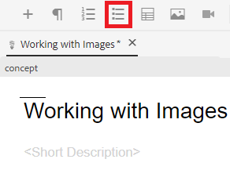
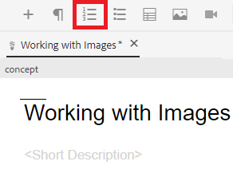

# Uso de listas

Es posible que necesite listas numeradas y con viñetas para organizar la información. A continuación se indican instrucciones sobre cómo insertar y trabajar con listas dentro de un concepto existente.

>[!VIDEO](https://video.tv.adobe.com/v/336658?quality=12&learn=on)

## Listas con viñetas

Se debe utilizar una lista con viñetas o sin ordenar cuando no sea necesario organizar los componentes de la lista en un orden determinado.

### Inserción de una lista con viñetas

1. Seleccione el **Insertar lista con viñetas** de la barra de herramientas.

   

   Aparece un punto de viñeta. Este es el principio de su lista.

1. Escriba su primer elemento de lista.
1. Pulse Entrar para crear una segunda entrada y escribir el contenido.
1. Siga agregando elementos de lista según sea necesario.

## Listas numeradas

Se debe utilizar una lista numerada cuando los componentes de la lista deban ordenarse o estructurarse de una manera determinada.

### Insertar una lista ordenada

1. Seleccione el **Insertar lista numerada** de la barra de herramientas.

   

   Se muestra un número. Este es el principio de su lista.

1. Escriba su primer elemento de lista.
1. Pulse Entrar para crear una segunda entrada y escribir el contenido.
1. Siga agregando elementos de lista según sea necesario.

## Guardar como nueva versión

Ahora que ha agregado más contenido al concepto, puede guardar el trabajo como una nueva versión y registrar los cambios.

1. Seleccione el **Guardar como nueva versión** icono.

   

1. En el campo Comentarios para la nueva versión, introduzca un breve pero claro resumen de los cambios.
1. En el campo Etiquetas de versión, introduzca las etiquetas relevantes.

   Las etiquetas permiten especificar la versión que desea incluir al publicar.

   >[!NOTE]
   > 
   > Si el programa está configurado con etiquetas predefinidas, puede seleccionar una de ellas para garantizar un etiquetado coherente.

1. Seleccione **Guardar**.

   Ha creado una nueva versión del tema y se actualiza el número de versión.
