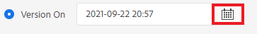

# Creación y publicación de líneas de base

El uso de una línea de base permite crear una versión de los temas del mapa y del contenido de referencia relacionado. Esto se puede basar en una fecha u hora específicas o en etiquetas.

>[!VIDEO](https://video.tv.adobe.com/v/338993?quality=12&learn=on)

## Acceso a la ficha Líneas de base en el tablero de mapas

Puede acceder a las líneas de base en el tablero de mapas.

1. Vista de repositorio, seleccione el icono Elipsis en el mapa para abrir el menú Opciones y, a continuación, **Abra el tablero de mapas.**

   
El tablero Mapa se abre en otra ficha.

1. Select **Líneas de base**.

   

Se muestra la ficha Líneas base .

## Creación de una línea de base basada en etiquetas

1. En la pestaña Líneas de base, seleccione **Crear**.

   

   Se muestra la información de la nueva línea base. Su nombre predeterminado se basa en la fecha de creación.

1. Asigne un nombre nuevo a la línea de base, si es necesario.

1. En el encabezado &quot;Set the version based on&quot; (Establecer la versión en función de), seleccione el círculo para Label.
   

   >[!NOTE]
   >
   >NOTA: La variable *Usar la versión más reciente si la etiqueta no está presente* está seleccionada de forma predeterminada. Si no se selecciona esta opción y en el mapa existen temas o archivos multimedia sin la etiqueta elegida, el proceso de creación de Línea de base fallará.

1. Introduzca la etiqueta que desee utilizar.

1. Seleccione **Guardar**.

Se crea la línea de base. Se muestra una tabla de todos los temas y su información asociada.

### Uso de la función Examinar todos los temas

La función Examinar todos los temas permite ver la información del tema, incluida la versión y la etiqueta, así como especificar la versión utilizada. Puede acceder a él seleccionando **Examinar todos los temas** al crear o editar la línea de base.

## Creación de una línea de base basada en la fecha y la hora

También puede crear líneas de base que sean una instantánea a tiempo.

1. Asegúrese de que la pestaña Líneas de base esté abierta y seleccione Crear.

   

1. En el encabezado &quot;Establecer la versión en función de&quot;, seleccione el círculo de &quot;Versión activada&quot;.

   

1. Seleccione el icono de calendario y especifique la fecha y la hora que desee.

   

1. Asigne un nombre nuevo a la línea base si es necesario.

1. Seleccione **Guardar**.

Se crea la línea de base. Se muestra una tabla de todos los temas y su información asociada.

### Adición de etiquetas a la línea de base

Puede que desee asignar una nueva etiqueta de forma masiva a todo el contenido del mapa.

1. Seleccione la línea de base para la que desea añadir etiquetas.

1. Select **Agregar etiquetas**.

   

   Aparece el cuadro de diálogo Agregar etiqueta .

1. Introduzca la etiqueta que desea asignar y seleccione **Agregar**.

La etiqueta se ha añadido a todos los temas.

## Generación de un resultado AEM del sitio con una línea de base

1. Vaya a la ficha Ajustes preestablecidos de salida en el panel de mapas.

1. Active la casilla AEM sitio .

   

1. Seleccione **Editar**.

   

   Se muestra una nueva página.

1. Seleccione la casilla de verificación Usar línea de base y elija la línea de base que desee utilizar en la lista desplegable.

   

1. Select **Listo**.

   

1. Select **Generar**.

   

   El resultado se ha generado con una línea de base.

## Visualización del resultado generado

1. Vaya a la pestaña Salidas en el panel de mapas.

1. Seleccione el texto de la columna Configuración de generación para abrir el resultado.
   

## Eliminación de una línea de base

1. En la pestaña Líneas de base, seleccione la línea de base que desee eliminar.

1. Select **Eliminar**.

   

   Aparece el cuadro de diálogo Quitar línea de base .

1. Select **Eliminar**.

Se elimina la línea base.

## Duplicación de una línea de base

1. En la pestaña Líneas de base, seleccione la línea de base que desee duplicar.

1. Select **Duplicar**.

   

1. Seleccione **Guardar**.

   

Se crea la línea de base duplicada.

## Modificación de una línea base

Puede especificar directamente la versión de un tema utilizado en una línea de base.

1. En la pestaña Líneas de base, seleccione la línea de base que desee modificar.
1. Seleccione **Editar**.

   

1. Select **Examinar todos los temas**.

   

   Se muestra una tabla de temas y su información asociada.

1. Para los temas que desee modificar, seleccione la versión que desee en la lista desplegable de la columna Versión .

   

1. Seleccione **Guardar**.

Se han guardado los cambios. La línea de base utilizará ahora las versiones del tema que haya especificado.

## Creación de un ajuste preestablecido de salida del sitio AEM personalizado

Es difícil distinguir entre las salidas predeterminadas del mismo tipo en la pestaña Outputs. El uso de un ajuste preestablecido de salida personalizado con un nombre único y fácil de usar le permite solucionar este problema.

En este caso, creamos un ajuste preestablecido de salida basado en una línea de base.

1. Vaya a la ficha Ajustes preestablecidos de salida en el panel de mapas.

1. Seleccione **Crear**.

   

   Se muestra una nueva página de ajuste preestablecido de salida, denominada Nueva salida.
1. En el campo Nombre de configuración , introduzca un nombre descriptivo.

1. Active la casilla de verificación Usar línea de base y seleccione la línea de base que desee en el menú desplegable.

   

1. Select **Listo**.

Se ha creado el nuevo ajuste preestablecido de salida y se muestra en la página de ajustes preestablecidos de salida.
