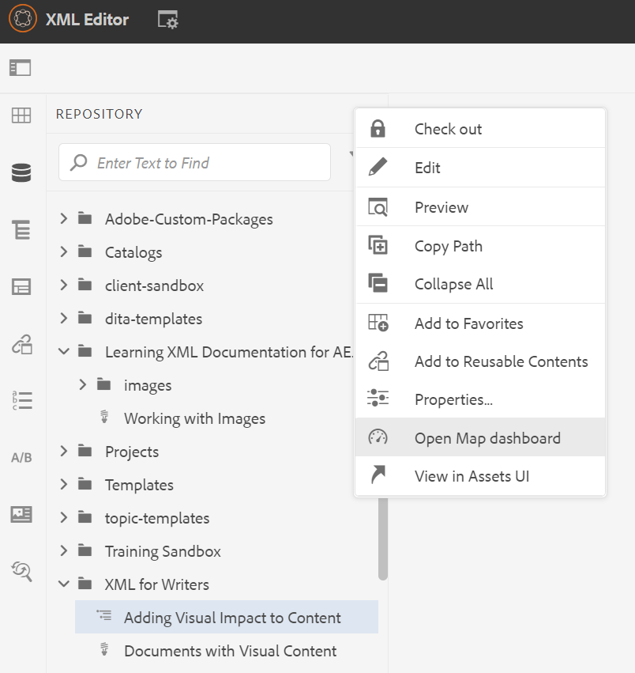

# Introducción al tablero de mapas

A continuación se ofrece una descripción general de las funciones principales del panel de mapas.

>[!VIDEO](https://video.tv.adobe.com/v/339040?quality=12&learn=on)

## Abra un mapa en el tablero de mapas

1. En Vista de repositorio, seleccione el icono de puntos suspensivos del mapa para abrir el menú Opciones y, a continuación, Abrir panel de mapas.
   

   El tablero de mapas se abre en otra pestaña.

## Componentes del tablero de mapas

El tablero de mapas contiene varias pestañas, incluidos ajustes preestablecidos de salida, resultados de salida, temas utilizados, líneas de base, etc.

### Valores de salida

AEM La pestaña Ajustes preestablecidos de salida muestra los ajustes preestablecidos predeterminados para los diferentes tipos de salidas: Sitio de la, PDF, HTML 5, ePub y Personalizado.

Puede seleccionar un ajuste preestablecido de salida para ver los detalles de su configuración, incluido el nombre de la transformación, la ruta de destino, las líneas de base y las condiciones aplicadas.

### Salidas

La pestaña Output muestra todas las salidas generadas anteriormente y las que se están generando actualmente.

Un círculo verde bajo la columna Configuración de generación indica que la salida se ha generado correctamente. El texto de esta columna actúa como un hipervínculo activo y puede seleccionarlo para abrir el resultado generado. Las entradas de la columna Tipo indican el tipo de salida.
Aquí también se muestra otra información de generación de resultados, incluido el nombre del usuario que generó la salida, la fecha y la hora de generación y el tiempo que tardó la generación en producirse. Si hay un error durante la generación, puede seleccionar la fecha y la hora de generación en la columna Generated At para abrir y revisar el registro de errores.

### Temas

La pestaña Temas muestra una lista de todos los temas del mapa.

Al seleccionar la casilla de verificación de un tema, puede realizar acciones adicionales. Puede editarlo, regenerarlo y mostrar, aplicar u ocultar sus etiquetas.

### Ajustes preestablecidos

La pestaña Ajustes preestablecidos de condición muestra los ajustes para que se incluya o excluya contenido condicional específico.

Al seleccionar la casilla de verificación de la edición Solo escritor, se obtiene un resultado que excluye todo el contenido con el atributo &quot;audiencia&quot; que tiene la etiqueta &quot;diseñadores&quot; e incluye todo el contenido con la etiqueta &quot;escritores&quot;.

### Líneas bases

La pestaña Líneas bases permite ver las líneas base.

Las líneas bases actúan como instantáneas en el tiempo y permiten crear una versión de los temas y recursos para publicarlos. Por ejemplo, una línea de base que captura contenido en una fecha y hora específicas puede utilizar la versión 1.3 de un tema y la 1.0 de otro tema, en función de sus versiones respectivas en ese momento.
Si no se especifica ninguna línea de base, la salida se genera con las últimas versiones de todo el contenido.

### Informes

La ficha Informes muestra un resumen de la información del tema, incluido el número total de temas en uso, los elementos que faltan dentro de estos temas y el estado del documento.

Si a un tema le falta un elemento, puede seleccionar la flecha situada más a la derecha de la fila para expandir la entrada y ver los detalles sobre el error.
