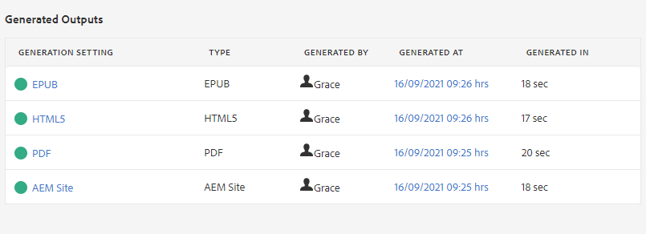

# Introducción al tablero de mapas

A continuación encontrará una descripción general de las principales funciones del tablero de mapas.

>[!VIDEO](https://video.tv.adobe.com/v/339040)

## Abra un mapa en el panel Mapa

1. En la vista Repositorio, seleccione el icono Elipsis en el mapa para abrir el menú Opciones y, a continuación, abra Tablero de Mapa.
   

   El tablero Mapa se abre en otra ficha.

## Componentes del tablero de mapas

El tablero Mapa contiene varias pestañas, incluidos ajustes preestablecidos de salida, resultados de salida, tema utilizado, líneas de base, etc.

### Ajustes preestablecidos de salida

La pestaña Ajustes preestablecidos de salida muestra los ajustes preestablecidos predeterminados para los distintos tipos de salidas: AEM Sitio, PDF, HTML5, ePub y Personalizado.

Puede seleccionar un ajuste preestablecido de salida para ver los detalles de su configuración, como el nombre de la transformación, la ruta de destino, las líneas de base y las condiciones aplicadas.

### Salidas

La pestaña Outputs muestra todas las salidas generadas anteriormente y que se están generando actualmente.

Un círculo verde debajo de la columna Configuración de generación indica que la salida se ha generado correctamente. El texto de esta columna actúa como un hipervínculo activo y puede seleccionarlo para abrir el resultado generado. Las entradas de la columna Tipo indican el tipo de salida.
Aquí también se muestra otra información de generación de salida, incluido el nombre del usuario que generó la salida, la fecha y la hora de generación y el tiempo que tardó en producirse la generación. Si hay un error durante la generación, puede seleccionar la fecha y la hora de generación en la columna Generated At para abrir y revisar el registro de errores.

### Temas

La ficha Temas muestra una lista de todos sus temas dentro del mapa.

La selección de la casilla de verificación de un tema le permite realizar acciones adicionales. Puede editarlo, regenerarlo y mostrar, aplicar u ocultar sus etiquetas.

### Ajustes preestablecidos de condición

La ficha Ajustes preestablecidos de condición muestra la configuración de contenido condicional específico que se va a incluir o excluir.

En este caso, si selecciona la casilla de verificación para la edición Solo escritor, se generará una salida que excluirá todo el contenido con el atributo &quot;audiencia&quot; que tenga la etiqueta &quot;diseñadores&quot; e incluirá todo el contenido con la etiqueta &quot;escritores&quot;.

### Líneas de base

La pestaña Líneas de base le permite ver sus líneas de base.

Las líneas de base actúan como instantáneas a tiempo y permiten crear una versión de los temas y recursos para publicarlos. Por ejemplo, una línea de base que captura contenido en una fecha y hora específicas puede utilizar la versión 1.3 de un tema y la 1.0 de otro, en función de sus respectivas versiones en ese momento.
Si no se especifica ninguna línea de base, el resultado se genera con las últimas versiones de todo el contenido.

### Informes

La ficha Informes muestra un resumen de la información del tema, que incluye el número total de temas en uso, la falta de elementos dentro de estos temas y el estado del documento.

Si falta un elemento en un tema, puede seleccionar la flecha situada más a la derecha de la fila para expandir la entrada y ver los detalles sobre el error.
