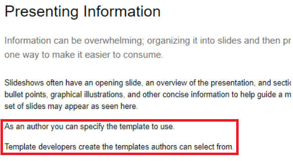
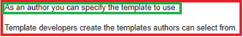
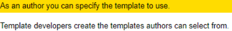
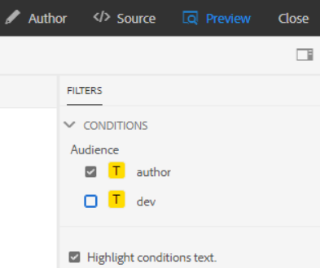
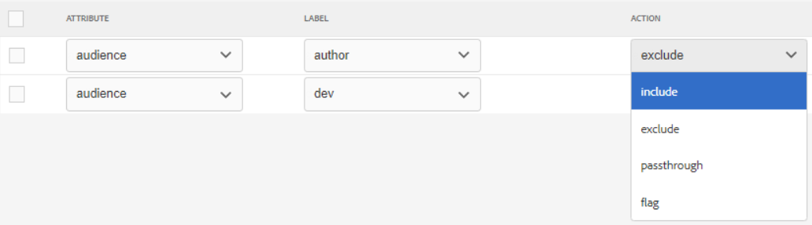
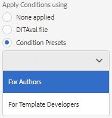
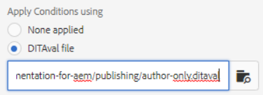

# Publicación con condiciones

La publicación condicional permite escribir una fuente de contenido para una o más audiencias, productos o plataformas. Esta información se puede publicar dinámicamente y solo se incluye contenido específicamente requerido en la salida.

>[!VIDEO](https://video.tv.adobe.com/v/339041?quality=12&learn=on)

## Preparación del ejercicio

Puede descargar archivos de muestra para el ejercicio aquí.

[Descarga de ejercicios](assets/exercises/publishing-with-conditions.zip)

## Marcado de contenido con atributos condicionales

1. Abra el tema que desee modificar.

2. Introduzca el texto que desea convertir en condicional. Por ejemplo, uno o más párrafos, una tabla completa, una figura u otro contenido.

   

3. Seleccione el contenido específico al que asignar un atributo condicional. Por ejemplo, un solo párrafo dentro del origen.

   

4. En el carril derecho, asegúrese de que se muestra la opción Propiedades .

5. Añada un atributo para audiencia, producto o plataforma.

6. Asigne un valor al atributo . Se han aplicado las actualizaciones de visualización de contenido para mostrar el marcado condicional.

   

## Vista previa del contenido condicional

1. Haga clic en **Vista previa**.

2. En **Filtros**, seleccione o anule la selección de las condiciones que desea mostrar u ocultar.

3. Seleccionar o anular la selección **Resaltar texto de condiciones**.

   

## Creación de un ajuste preestablecido de condición

Un ajuste preestablecido de condición es una colección de propiedades que definen lo que se va a incluir, excluir o marcar de otra manera durante la generación de la salida.

1. En el panel de mapas, seleccione la opción **Ajustes preestablecidos de condición** pestaña .

2. Haga clic en **Crear**.

3. Select **Agregar** (o **Agregar todo**).

4. Asigne un nombre a la condición.

5. Seleccione una combinación de atributo, etiqueta y acción.

   

6. Repita el proceso tantas veces como sea necesario.

7. Haga clic en **Guardar**.

## Generación de resultados condicionales

Una vez aplicadas las condiciones al contenido, se puede generar como salida. Puede utilizar un ajuste preestablecido de condición o un archivo DITAval.

## Generación de resultados condicionales mediante un ajuste preestablecido de condición

1. Seleccione el **Ajustes preestablecidos de salida** pestaña .

2. Seleccione un ajuste preestablecido de salida.

3. Haga clic en **Editar**.

4. En **Aplicar condición usando** seleccione un ajuste preestablecido de condición.

   

5. Haga clic en **Listo**.

6. Genere el ajuste preestablecido de salida y revise el contenido.

## Generación de resultados condicionales mediante un archivo DITAval

El archivo DITAval se puede usar para publicar contenido condicional. Esto requiere que se cree o cargue un archivo y que después se haga referencia a él en la publicación.

1. Seleccione el **Ajustes preestablecidos de salida** pestaña .

2. Seleccione un ajuste preestablecido de salida.

3. Haga clic en **Editar**.

4. En Aplicar condición utilizando seleccione un archivo DITAval.

   

5. Haga clic en **Listo**.

6. Genere el ajuste preestablecido de salida y revise el contenido.
