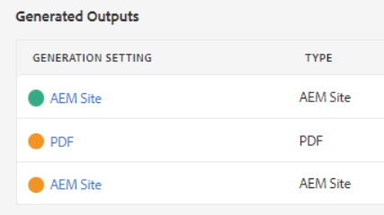
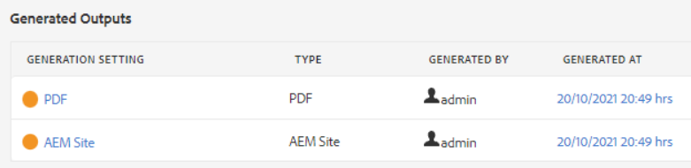
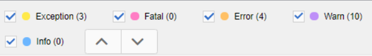

# Solución de problemas de publicación

La publicación de un mapa suele ser sencilla. Abra el mapa, seleccione un ajuste preestablecido de salida y genere la salida. Sin embargo, si un mapa o sus temas contienen errores, la generación de salida puede fallar. Cuando esto sucede, es importante saber cómo solucionar problemas.

>[!VIDEO](https://video.tv.adobe.com/v/338990?quality=12&learn=on)

## Preparación del ejercicio

Puede descargar archivos de muestra para el ejercicio aquí.

[Descarga de ejercicios](assets/exercises/publishing-basic-to-advanced.zip)

## Causas comunes de los errores de publicación

Los errores se pueden introducir en el contenido de origen. Por ejemplo:

* Referencia de ruta de archivo con nombre incorrecto

* Carpeta con nombre incorrecto

* Falta el gráfico o archivo

* Referencia de contenido configurada incorrectamente

* Referencia cruzada rota

* Errores en los valores de un atributo (por ejemplo, una cadena en lugar de un número)

* Configuración incorrecta de los componentes utilizados por [!DNL AEM Guides]

## Impacto de los errores

Un error puede ser menor y dar como resultado una nota simple para informarle de que un archivo no se empaquetó correctamente, o lo suficientemente grave como para que se produzca un error total en la generación de resultados. La pestaña Outputs muestra iconos con códigos de color para mostrar el éxito, los errores o los errores relacionados con la generación de resultados.

## Apertura y revisión de registros de errores

El archivo de registro generado se puede abrir para su revisión.

1. En el **Salidas** , haga clic en la pestaña **fecha y hora en Generated At.**

   

1. Desplácese por el registro de errores.

## Mostrar y ocultar tipos de error

El registro de errores muestra cada tipo de error en un color único.

1. **Select** o **anular selección** cualquier tipo de error para mostrar u ocultar el resaltado.

1. Desplazamiento por los errores utilizando la variable **next** o **previous** botones (flechas).

## Resolución de errores

Según el tipo de error, la resolución puede ser simple o compleja. Puede ser completado por un autor en el Editor XML o puede requerir que un administrador trabaje con [!DNL AEM Guides]. Las correcciones específicas dependen del error, el impacto y los flujos de trabajo de la organización.

* Referencia de ruta de archivo con nombre incorrecto

       Los autores pueden actualizar la referencia de ruta en el documento de origen.
       
   
* Carpeta con nombre incorrecto

       Los autores pueden actualizar el nombre de la carpeta o mover los archivos según sea necesario.
       
   
* Falta el gráfico o archivo

       Los autores pueden cargar un gráfico o archivo que falte, cambiar el nombre de un gráfico o archivo o mover un gráfico o archivo
       
   
* Referencia de contenido configurada incorrectamente

       Los autores pueden corregir la ubicación del contenido al que se hace referencia o cambiar la ruta a la referencia de contenido.
       
   
* Referencia cruzada rota

       Los autores pueden corregir la ubicación a la que hacen referencia cruzada o cambiar el nombre o las propiedades del archivo de destino
       
   
* Errores en los valores de un atributo (por ejemplo, una cadena en lugar de un número)

       Los autores pueden actualizar el atributo a un valor correcto o los administradores pueden actualizar el sistema para que admita nuevos valores.
       
   
* Configuración incorrecta de los componentes utilizados por [!DNL AEM Guides]

       Los administradores pueden actualizar la instalación del sistema, sus componentes o permisos.
       
   