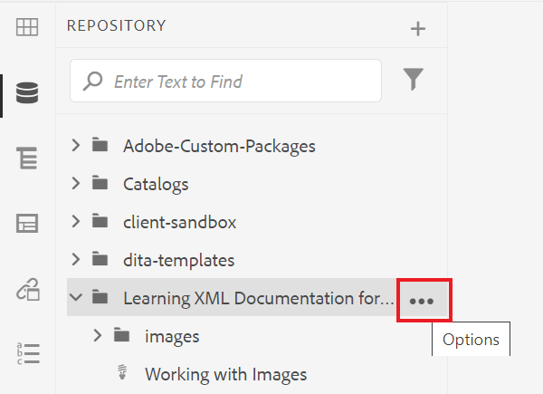
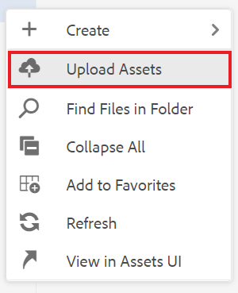
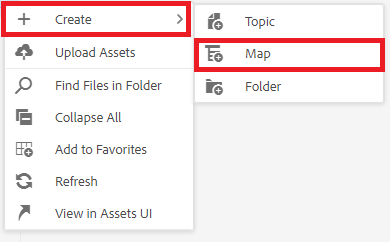
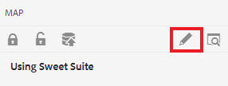
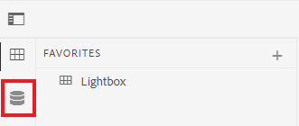
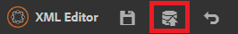
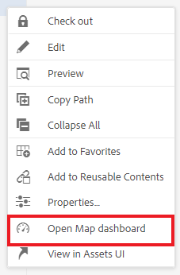
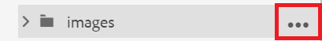
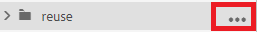
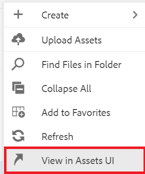

# Uso de informes

La ficha Informes del panel de mapas le permite identificar y resolver vínculos rotos, contenido al que se hace referencia y reutilizado (conrefs), referencias cruzadas u otra información que falte.

>[!VIDEO](https://video.tv.adobe.com/v/339039)

## Preparación del ejercicio

Puede descargar archivos de muestra para el ejercicio aquí.

[Descarga de ejercicios](assets/exercises/working-with-reports.zip)

## Carga de recursos

1. En la vista Repositorio, seleccione el icono Elipsis de la carpeta principal para abrir el menú Opciones.

   

2. Select **[!UICONTROL Cargar recursos]**.

   

3. Seleccione los archivos que desea cargar en la carpeta y seleccione **Cargar**.

Los archivos DITA se abren y debe revisarlos para ver si hay problemas con contenido faltante, conrefs o referencias cruzadas.

## Creación de un mapa

1. Seleccione el icono Elipsis de la carpeta principal para abrir el menú Opciones.

   

2. Select **Crear > Mapa**.

   

   Aparece el cuadro de diálogo Crear nuevo mapa .

3. En el campo Plantilla , seleccione **Bookmap** (o **Mapa** en función del tipo de contenido que esté creando) en el menú desplegable y asigne un título a la asignación.

4. Seleccione **Crear**.

Se crea el mapa y el carril izquierdo cambia automáticamente de la vista Repositorio a la vista Mapa.

## Inserción de componentes de mapa

1. Seleccione el icono de lápiz en el carril izquierdo.
Este es el icono Editar y le permite abrir el mapa en el editor.

   

2. Vuelva a la vista Repositorio seleccionando el icono Repositorio .

   

3. Añada un tema al mapa arrastrándolo y soltándolo desde el Repositorio en el mapa del editor.
El indicador de línea le mostrará dónde se colocará el tema.

4. Siga agregando temas según sea necesario.

5. Cuando termine, seleccione **Guardar como nueva versión.**

   

6. En el *Comentarios para la nueva versión* , introduzca un comentario descriptivo.

7. Seleccione **Guardar**.

## Generación de un resultado de sitio AEM

1. En el Repositorio, seleccione el icono Elipsis en el mapa para abrir el menú Opciones y, a continuación, **Abra el tablero de mapas.**

   

   El tablero Mapa se abre en otra ficha.
2. En la ficha Ajustes preestablecidos de salida, seleccione **Sitio AEM**.

   

3. Select **Generar**.

4. Vaya a la página Resultados para ver el estado de las salidas generadas.
Si hay errores, la pestaña Outputs puede mostrar un círculo naranja bajo la columna Generation Setting en lugar de verde, indicando que la generación ha finalizado.

5. Seleccione el vínculo en la columna Configuración de generación para abrir la salida generada.
Revise el resultado para ver si falta contenido.

## La ficha Informes

La ficha Informes muestra un resumen del tema y una tabla que contiene información del tema y los problemas dentro del mapa.

Lo ideal es comprobar siempre los informes en busca de un mapa después de importar contenido.

La columna Elementos que faltan indica el número de imágenes que faltan y conrefs rotos. Puede seleccionar el **Lápiz** para abrir el tema en el editor.

## Resolución de imágenes que faltan

Si faltan imágenes en los archivos, una causa común podría ser que el contenido se ha cargado, pero las imágenes no. Si es así, resuelva los problemas de imagen que faltan cargando imágenes en una carpeta específica que coincida con la ruta y los nombres de archivo que esperan los archivos.

1. En *Vista del repositorio*, seleccione el icono Elipsis de la carpeta de imágenes para abrir el menú Opciones .

   

2. Select **[!UICONTROL Cargar recursos]** y seleccione las imágenes que faltan.

3. Select **Cargar**.

Se han cargado las imágenes que faltan. Ahora, un resultado de AEM del sitio recién generado mostrará estas imágenes, y la ficha Informes ya no mostrará ningún error de imagen que falte.

## Resolución de conrefs rotos

Si el contenido al que se hace referencia en otra parte (una conref) vincula a para un archivo dentro de otra carpeta (por ejemplo, uno llamado &quot;reutilizar&quot;). y el contenido no se carga, se debe resolver un error. Por ejemplo, debe crear una subcarpeta llamada &quot;reutilizar&quot; y cargar el archivo que falta en &quot;reutilizar&quot;.

### Carga de un recurso con la variable [!UICONTROL Recursos] IU

Además del [!UICONTROL Cargar recursos] , puede cargar recursos arrastrándolos y soltándolos en la interfaz de usuario de Assets.

1. En la vista Repositorio, seleccione el icono Elipsis de la carpeta de reutilización para abrir el menú Opciones.

   

2. Select **Ver en la interfaz de usuario de Assets**.

   

3. Arrastre y suelte el archivo en la carpeta .
El archivo se carga y se resuelve el error de referencia.

Todos los errores se han resuelto. La página Informes indicará que no hay más errores y la generación de un sitio AEM da como resultado un resultado completo sin componentes faltantes.
