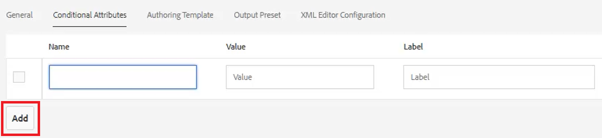
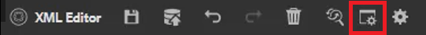
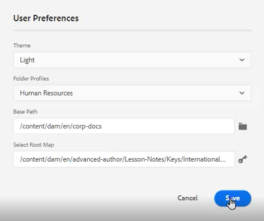
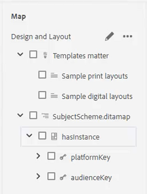
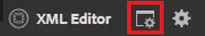
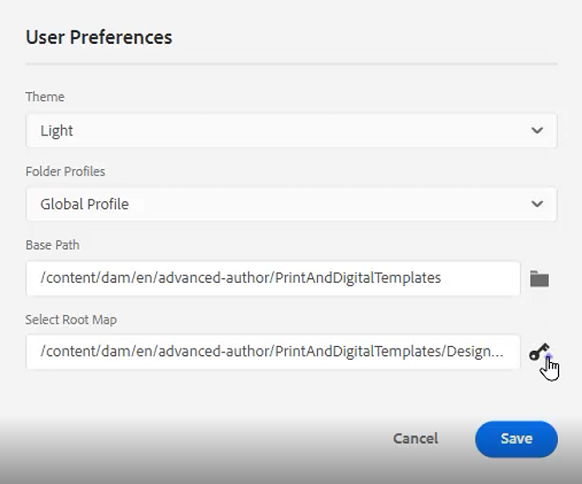

# Condiciones

En DITA, las condiciones suelen impulsarse a través de atributos como Producto, Plataforma y Audiencia. También pueden tener valores específicos asignados a ellos. Los usuarios pueden controlar todo esto a través de Perfiles de carpeta.

Los archivos de muestra que puede utilizar para esta lección se proporcionan en el archivo . [conditions.zip](assets/conditions.zip).

>[!VIDEO](https://video.tv.adobe.com/v/342755?quality=12&learn=on)

## Asignar condiciones a un perfil de carpeta

1. Seleccione el **Perfiles de carpeta** mosaico.

1. Haga clic en [!UICONTROL **Atributos condicionales**].

1. Haga clic en [!UICONTROL **Editar**] en la esquina superior izquierda del perfil.

1. Haga clic en [!UICONTROL **Agregar**].

   

1. Rellene los campos obligatorios.

   - El nombre debe corresponder a un atributo utilizado para la creación de perfiles.

   - El valor es la entrada exacta que se utilizará en la fuente de código DITA.

   - Label es la palabra que verá el usuario que está introduciendo atributos.

1. Haga clic en [!UICONTROL **Guardar**].

>[!NOTE]
>
>NOTA: configurar un perfil global puede ser una forma temprana y eficaz de controlar el uso de atributos y valores para seguir una guía de estilo coherente.

## Asignar atributos a elementos

Si no se ha asignado ningún perfil de carpeta personalizado a un concepto, puede que desee asignar atributos a elementos específicos, como párrafos.

1. En el **Vista del repositorio**, haga clic en el elemento con el que desee trabajar para seleccionarlo.

1. En el **Propiedades de contenido** , haga clic en el [!UICONTROL **Atributo**] lista desplegable.

1. Elija el atributo que desea asignar.

1. Agregue un **Valor**.

El atributo y el emparejamiento de valores ahora se asignan al elemento seleccionado.

## Asignación de pares de atributos y valores mediante condiciones

El panel Condiciones permite la asignación controlada de pares de atributos y valores.

1. Modifique el **Preferencias de usuario**.

   a. Haga clic en el icono Preferencias de usuario .

   

   b. Complete los campos obligatorios en la variable **Preferencias de usuario** diálogo. Por ejemplo:

   

   c. Haga clic en [!UICONTROL **Guardar**].

1. En el panel condiciones, expanda los menús desplegables para Audiencia y Plataforma. Tenga en cuenta que las condiciones disponibles son específicas del perfil de carpeta.

1. Arrastre y suelte una condición en el elemento deseado para asignarla.

## Asignar un esquema de sujeto

Los mapas del esquema de sujetos son una forma especializada de ditamap y están referenciados por un mapa. Los esquemas de asunto se utilizan para definir las taxonomías. Proporcionan control sobre los valores disponibles.

1. Vaya a la **Vista del repositorio**.

1. Seleccione un mapa que haga referencia al diagrama de esquema de sujeto. Este ejemplo utiliza el mapa llamado _Diseño y diseño_.

   

1. Configure las preferencias de usuario.

   a. Haga clic en el [!UICONTROL **Preferencias de usuario**] icono.

   

   b. Rellene los campos del **Preferencias de usuario** diálogo.

   c. Haga clic en el símbolo de carpeta situado junto al campo Ruta base para elegir la ruta al archivo deseado.

   d. Haga clic en [!UICONTROL **Select**].

   e. Haga clic en el símbolo de clave situado junto a la **Mapa raíz** para introducir una ruta.

   >[!IMPORTANT]
   >
   >Importante: el mapa raíz seleccionado debe ser el mapa que contiene el esquema de sujeto.

   

   f. Restrinja los recursos mostrados seleccionando las carpetas que desee utilizar.

   g. Haga clic en [!UICONTROL **Select**].

   h. Haga clic en [!UICONTROL **Guardar**].

Se ha asignado el sistema de temas.

## Ver el esquema de sujetos desde el panel Condiciones

1. Vaya a **Configuración del editor**.

1. Seleccione el **Condiciones** pestaña .

1. Marque la casilla . **Mostrar esquema de asunto en el panel Condiciones**
