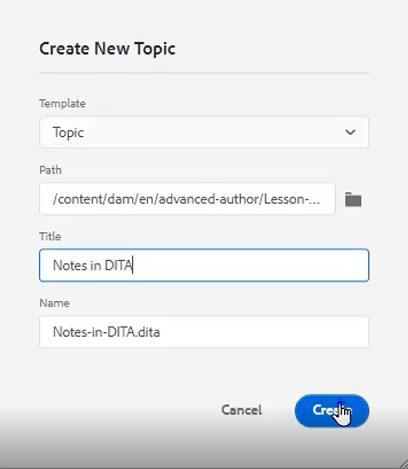
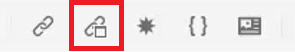
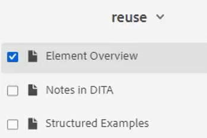
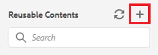

# Reutilización de contenido

Una de las características principales de DITA es la capacidad de reutilizar contenido. Permite reutilizar contenido desde frases pequeñas hasta temas completos o mapas.  Sin embargo, para que el contenido se reutilice de forma eficaz, debe estar bien administrado. Asegúrese de tener una estrategia de contenido eficaz cuando trabaje con información reutilizable.

>[!VIDEO](https://video.tv.adobe.com/v/342757)

## Crear un tema reutilizable

Cuando se realiza un cambio en un tema de origen reutilizable, la información se actualiza dondequiera que se utilice el contenido.

1. Vaya a la **Repositorio**.

2. Haga clic en el **menú contextual** junto a la carpeta reutilizar.

3. Choose **Crear > Tema dita**.

4. Rellene los campos del cuadro de diálogo Crear nuevo tema . Por ejemplo:

   

5. Haga clic en [!UICONTROL **Crear**].

6. Agregue contenido al tema según sea necesario.

## Añadir un nuevo elemento reutilizable a un tema

Existen varios métodos para añadir elementos reutilizables. En este caso, el primer flujo de trabajo es mejor cuando se añade solo un componente. El segundo flujo de trabajo es mejor para añadir varios componentes reutilizables.

### Flujo de trabajo 1

1. Haga clic en el tema en una ubicación válida.

2. Seleccione el **Insertar contenido reutilizable** en la barra de herramientas superior.

   

3. En el cuadro de diálogo Reutilizar contenido , haga clic en el botón [!UICONTROL **Carpeta**] icono.

4. Vaya a la carpeta requerida.

5. Elija un tema con componentes reutilizables.
Por ejemplo:

   

6. Haga clic en [!UICONTROL **Select**].

7. Elija un componente específico para reutilizarlo.

8. Haga clic en [!UICONTROL **Select**].

El elemento reutilizable se ha insertado en el tema.

### Flujo de trabajo 2

1. Vaya a **Contenido reutilizable** en el panel izquierdo.

2. Haga clic en el [!UICONTROL **Agregar**] en el panel Contenido reutilizable.

   

3. Vaya a una carpeta.

4. Seleccione uno o varios temas específicos.

5. Haga clic en [!UICONTROL **Agregar**].

6. Desde el panel Contenido reutilizable, expanda **Información general de elementos**.

7. Arrastre y suelte un elemento en el tema en una ubicación válida.

El elemento reutilizable se ha insertado en el tema.

## Asignar un ID y un valor a un elemento

La entrada que acaba de crear es un elemento reutilizable. Por lo tanto, requiere un ID y un valor.

1. Haga clic dentro de la entrada.

2. En el panel Propiedades del contenido, haga clic en el menú desplegable debajo de Atributo.

3. Select **ID**.

4. Escriba un nombre lógico para el valor.

5. Guarde o cree una versión del tema para que el cambio se refleje en el Repositorio.

El ID y el valor se han asignado al elemento .
