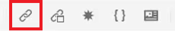
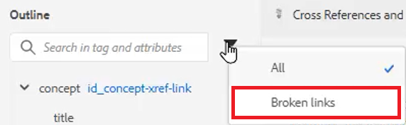

# Referencias cruzadas y vínculos

El Editor XML y DITA proporcionan una manera poderosa de vincular entre temas. Es importante administrar de forma eficaz las referencias de contenido, y eso incluye trabajar con valores de ID únicos.

Los archivos de muestra que puede utilizar para esta lección se proporcionan en el archivo .
[referencias cruzadas andlinks.zip](assets/crossreferencesandlinks.zip)

>[!VIDEO](https://video.tv.adobe.com/v/342764)

## Creación de una referencia cruzada a un tema externo

Es posible crear una referencia cruzada externa arrastrando y soltando un tema del Repositorio en un archivo abierto. Sin embargo, para evitar referencias cruzadas rotas, primero debe definirse un ID para un valor relacionado con el elemento principal. Esta es una forma sencilla de crear una referencia cruzada, asegurándose de que los ID se asignen correctamente.

1. Abra un archivo en el que desee insertar una referencia cruzada externa.

2. Asigne un ID al elemento al que desea hacer referencia.

   a. Haga clic dentro del elemento .

   b. En el panel Propiedades del contenido, seleccione **ID** en la lista desplegable Atributo .

   c. Escriba un nombre lógico en el campo Valor.

   d. Ver el elemento y su valor en **Vista Esquema** si lo desea.

3. **Guardar** el tema para garantizar que el Repositorio tenga el ID actualizado.

4. Haga clic en el [!UICONTROL **Referencia**] en la barra de herramientas superior.

   

5. En el **Referencia de contenido** , seleccione el ID y el emparejamiento de elementos que desea insertar como referencia cruzada.

6. Haga clic en [!UICONTROL **Select**].

Se ha añadido la referencia cruzada al tema.

## Vínculo a un sitio web

Puede insertar un vínculo a un sitio web dentro de cualquier tema. Para obtener más información, consulte el vídeo del curso 1 de guías de AEM sobre la vinculación a sitios web.

## Ver vínculos rotos

Algunas modificaciones pueden provocar referencias cruzadas rotas. Entre ellas se incluyen la eliminación de un tema, la reorganización de una sección que contenga una referencia cruzada o el cambio de un ID después de insertar la referencia cruzada. Tenga en cuenta que hay un tema de muestra _referencias cruzadas andlinks.zip_ se proporciona con esta lección que provocará que se rompan varias de las referencias cruzadas con viñetas al contenido interno.

1. Vaya a la **Vista Esquema** en el panel izquierdo.

2. Haga clic en el [!UICONTROL **Filtro**] icono.

3. Select **Vínculos rotos**.

   

Los vínculos rotos se muestran como objetos en los que se puede hacer clic. Puede identificarlos con texto rojo en el tema.
