# Configuración del Editor XML

Si trabaja en un entorno restrictivo, puede elegir qué características pueden ver sus autores personalizando la configuración del editor en un perfil de carpeta específico. La aplicación de este perfil de carpeta puede cambiar el aspecto del editor, las plantillas CSS, los fragmentos disponibles y las etiquetas de versión de contenido.

Los archivos de muestra que puede utilizar para esta lección se proporcionan en el archivo . [xmleditorconfiguration.zip](assets/xmleditorconfiguration.zip).

>[!VIDEO](https://video.tv.adobe.com/v/342762?quality=12&learn=on)

## Personalización de la configuración predeterminada de la interfaz de usuario del Editor

Siempre puede descargar la configuración predeterminada de la interfaz de usuario en su sistema local, realizar cambios en el editor de texto que elija y volver a cargarla.

1. En la pantalla Navegación, haga clic en el [!UICONTROL **Herramientas**] icono.

   

1. Select **Guías** en el panel izquierdo.

1. Haga clic en el [!UICONTROL **Perfiles de carpeta**] mosaico.

   

1. Seleccione un perfil de carpeta.

1. Haga clic en el [!UICONTROL **Configuración del Editor XML**] pestaña .

1. Haga clic en [!UICONTROL **Descargar**] Predeterminado.

   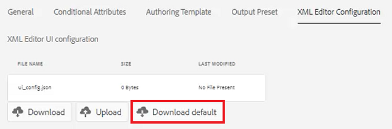

Ahora puede abrir y modificar el contenido en un editor de texto. La variable _Instalación y configuración de guías AEM_ La guía contiene ejemplos de cómo quitar, personalizar o agregar funciones a la configuración de la interfaz de usuario.

## Cargar la configuración de la interfaz de usuario del Editor XML modificada

Después de personalizar la configuración de la interfaz de usuario, puede cargarla. Tenga en cuenta que un archivo de configuración de muestra _ui-config-restrict-editor.json_ se proporciona con el conjunto de temas de apoyo para esta lección.

1. Dentro del perfil de carpeta, haga clic en la [!UICONTROL **Configuración del Editor XML**] pestaña .

1. En la configuración de la interfaz de usuario del Editor XML, haga clic en [!UICONTROL **Cargar**].

   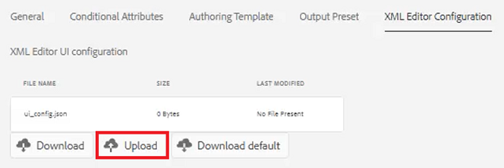

1. Haga doble clic en el archivo para la configuración de la interfaz de usuario modificada o, como se muestra aquí, en el archivo de muestra proporcionado.

   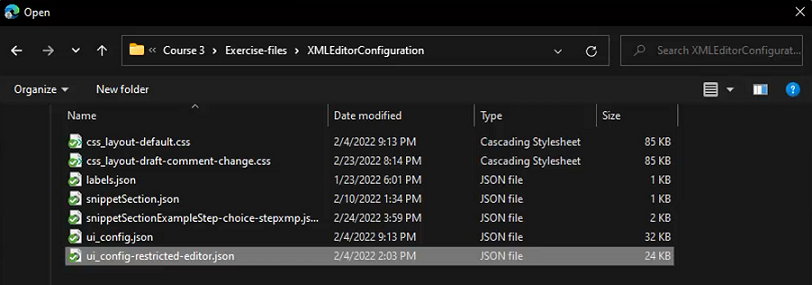

1. Haga clic en [!UICONTROL **Guardar**] en la esquina superior izquierda de la pantalla.

Ha cargado correctamente la configuración de la interfaz de usuario modificada.

## Personalizar el diseño de la plantilla CSS

Al igual que con la configuración de la interfaz de usuario, puede descargar el diseño de la plantilla CSS. Puede abrirlo en un editor de texto y realizar modificaciones para personalizar el aspecto del tema antes de cargarlo.

1. En la pantalla Navegación, haga clic en el [!UICONTROL **Herramientas**] icono.

   

1. Select **Guías** en el panel izquierdo.

1. Haga clic en el [!UICONTROL **Perfiles de carpeta**] mosaico.

   

1. Seleccione un perfil de carpeta.

1. Haga clic en el [!UICONTROL **Configuración del Editor XML**] pestaña .

1. En Diseño de plantilla CSS, haga clic en [!UICONTROL **Descargar**].

   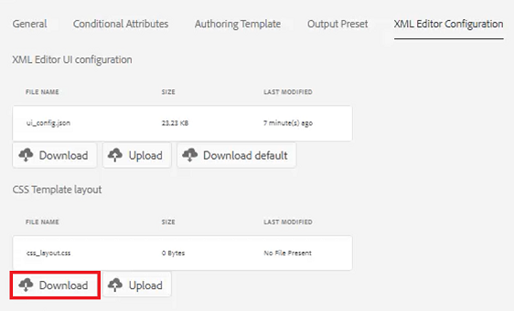

Ahora puede modificar y guardar el contenido CSS en un editor de texto.

## Cargar el diseño modificado de la plantilla CSS

Después de personalizar el diseño de la plantilla CSS, puede cargarlo. Tenga en cuenta que un archivo de muestra _css-layout-ONLY-Draft-comment-change.css_ se proporciona con el conjunto de temas de apoyo para esta lección. Este archivo contiene solo el cambio de comentario de borrador, mientras que _css-layout-Draft-comment-change.css_ es el archivo completo, disponible solo para fines de prueba o revisión.

1. Dentro del perfil de carpeta, haga clic en la [!UICONTROL **Configuración del Editor XML**] pestaña .

1. En Diseño de plantilla CSS, haga clic en [!UICONTROL **Cargar**].

   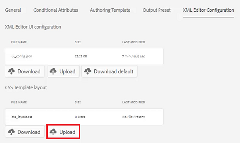

1. Haga doble clic en el archivo para su propio diseño CSS personalizado o en el archivo de muestra proporcionado que se muestra aquí.

   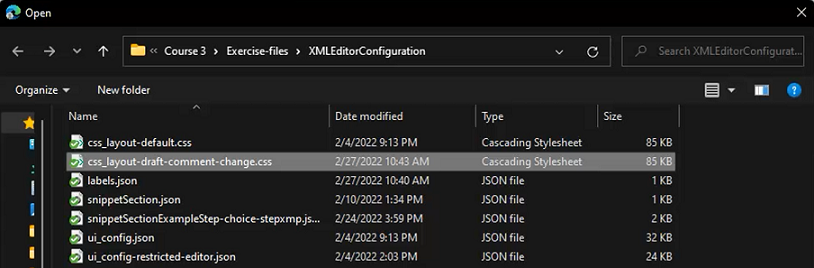

1. Haga clic en [!UICONTROL **Guardar**] en la esquina superior izquierda de la pantalla.
Ha cargado correctamente el diseño de plantilla CSS personalizada.

## Editar fragmentos del editor XML

Los fragmentos son fragmentos de contenido reutilizables que pueden ser específicos de un producto o grupo. Tenga en cuenta que se proporcionan fragmentos de muestra con los archivos de compatibilidad para esta lección.

1. En la pantalla Navegación, haga clic en el [!UICONTROL **Herramientas**] icono.

   

1. Select **Guías** en el panel izquierdo.

1. Haga clic en el [!UICONTROL **Perfiles de carpeta**] mosaico.

   

1. Seleccione un perfil de carpeta.

1. Haga clic en el [!UICONTROL **Configuración del Editor XML**] pestaña .

1. En Fragmentos del Editor XML, haga clic en **Cargar**.

   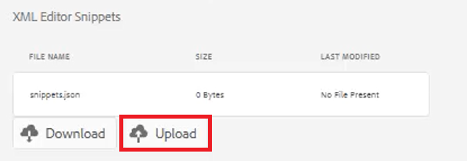

1. Elija sus propios fragmentos o use las muestras proporcionadas.

   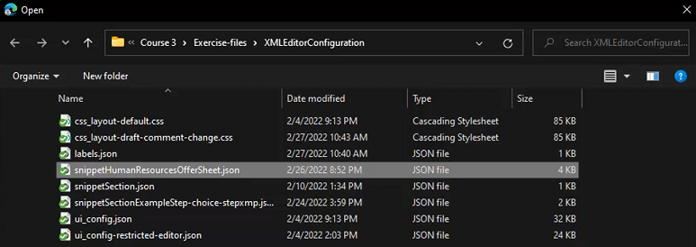

1. Haga clic en [!UICONTROL **Guardar**] en la esquina superior izquierda de la pantalla.

Ha añadido correctamente nuevos fragmentos de texto al editor.

## Personalizar etiquetas de versiones de contenido XML

De forma predeterminada, los autores pueden crear etiquetas de su elección y asociarlas a archivos de temas. Esto puede dar lugar a diferentes variaciones en la misma etiqueta. Para evitar un etiquetado incoherente, también puede elegir entre listas de etiquetas predefinidas.

1. En la pantalla Navegación, haga clic en el [!UICONTROL **Herramientas**] icono.

   

1. Select **Guías** en el panel izquierdo.

1. Haga clic en el [!UICONTROL **Perfiles de carpeta**] mosaico.

   

1. Seleccione un perfil de carpeta.

1. Haga clic en el [!UICONTROL **Configuración del Editor XML**] pestaña .

1. En Etiquetas de versiones de contenido XML, haga clic en [!UICONTROL **Descargar**].

   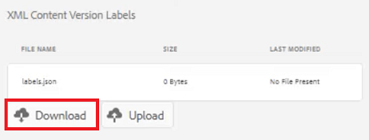

Ya está listo para personalizar las etiquetas según sea necesario.

## Cargar etiquetas de versión de contenido XML

Una vez que haya descargado y modificado las etiquetas, puede cargar el tema Etiqueta de versión de contenido XML . Puede elegir utilizar el archivo de muestra _labels.json_, con el conjunto de temas de apoyo para esta lección.

1. Dentro del perfil de carpeta, haga clic en la [!UICONTROL **Configuración del Editor XML**] pestaña .

1. En Etiquetas de versiones de contenido XML, haga clic en [!UICONTROL **Cargar**].

   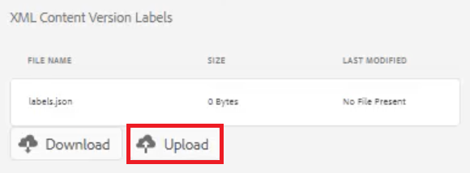

1. Haga doble clic en el archivo para sus propias etiquetas personalizadas o en el archivo de muestra proporcionado que se muestra aquí.

   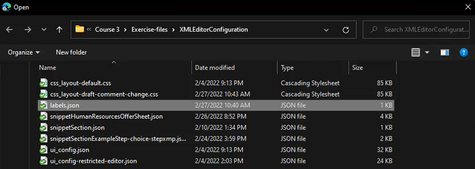

1. Haga clic en [!UICONTROL **Guardar**] en la esquina superior izquierda de la pantalla.

Ha cargado correctamente etiquetas de versión de contenido XML personalizadas.
