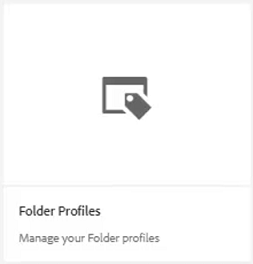

# Configuración del editor XML

Si trabaja en un entorno restrictivo, puede elegir las funciones que los autores pueden ver personalizando la Configuración del editor dentro de un perfil de carpeta específico. La aplicación de este perfil de carpeta puede cambiar la apariencia del editor en sí, las plantillas CSS, los fragmentos disponibles y las etiquetas de versión de contenido.

En el archivo se proporcionan archivos de ejemplo que puede optar por utilizar para esta lección [xmleditorconfiguration.zip](assets/xmleditorconfiguration.zip).

>[!VIDEO](https://video.tv.adobe.com/v/342762?quality=12&learn=on)

## Personalizar la configuración predeterminada de la interfaz de usuario del editor

Siempre puede descargar la configuración de interfaz de usuario predeterminada en el sistema local, realizar cambios en el editor de texto que desee y cargarla de nuevo.

1. En la pantalla de navegación, haga clic en el botón [!UICONTROL **Herramientas**] icono.

   

1. Seleccionar **Guías** en el panel izquierdo.

1. Haga clic en [!UICONTROL **Perfiles de carpeta**] mosaico.

   

1. Seleccione un perfil de carpeta.

1. Haga clic en [!UICONTROL **Configuración del editor XML**] pestaña.

1. Clic [!UICONTROL **Descargar**] Predeterminado.

   

Ahora puede abrir y modificar el contenido en un editor de texto. El _AEM Instalación y configuración de las guías de la_ La Guía contiene ejemplos de cómo quitar, personalizar o agregar funciones a la configuración de la interfaz de usuario.

## Cargar la configuración de la interfaz de usuario del editor XML modificada

Después de personalizar la configuración de la interfaz de usuario, puede cargarla. Tenga en cuenta que un archivo de configuración de muestra _ui-config-restrict-editor.json_ se proporciona con el conjunto de temas de apoyo para esta lección.

1. En el Perfil de carpeta, haga clic en [!UICONTROL **Configuración del editor XML**] pestaña.

1. En Configuración de la IU del Editor XML, haga clic en [!UICONTROL **Cargar**].

   

1. Haga doble clic en el archivo para la configuración de la interfaz de usuario modificada o, como se muestra aquí, en el archivo de muestra proporcionado.

   

1. Clic [!UICONTROL **Guardar**] en la esquina superior izquierda de la pantalla.

La configuración de la IU modificada se ha cargado correctamente.

## Personalizar el diseño de la plantilla CSS

Al igual que con la configuración de la interfaz de usuario, puede descargar el diseño de la plantilla CSS. Puede abrirlo en un editor de texto y realizar modificaciones para personalizar el aspecto del tema antes de cargarlo.

1. En la pantalla de navegación, haga clic en el botón [!UICONTROL **Herramientas**] icono.

   

1. Seleccionar **Guías** en el panel izquierdo.

1. Haga clic en [!UICONTROL **Perfiles de carpeta**] mosaico.

   

1. Seleccione un perfil de carpeta.

1. Haga clic en [!UICONTROL **Configuración del editor XML**] pestaña.

1. En Diseño de plantilla CSS, haga clic en [!UICONTROL **Descargar**].

   

Ahora puede modificar y guardar el contenido CSS en un editor de texto.

## Cargar el diseño de plantilla CSS modificado

Después de personalizar el diseño de la plantilla CSS, puede cargarla. Tenga en cuenta que un archivo de muestra _css-layout-ONLY-draft-comment-change.css_ se proporciona con el conjunto de temas de apoyo para esta lección. Este archivo contiene únicamente el Borrador de cambio de comentario, mientras que _css-layout-draft-comment-change.css_ es el archivo completo, disponible solo para fines de prueba o revisión.

1. En el Perfil de carpeta, haga clic en [!UICONTROL **Configuración del editor XML**] pestaña.

1. En Diseño de plantilla CSS, haga clic en [!UICONTROL **Cargar**].

   

1. Haga doble clic en el archivo para su propio diseño CSS personalizado o en el archivo de ejemplo proporcionado que se muestra aquí.

   

1. Clic [!UICONTROL **Guardar**] en la esquina superior izquierda de la pantalla.
Ha cargado correctamente el diseño de plantilla CSS personalizado.

## Editar fragmentos de código del editor XML

Los fragmentos de código son fragmentos de contenido reutilizables que pueden ser específicos de un producto o grupo. Tenga en cuenta que los fragmentos de código de ejemplo se proporcionan con los archivos de compatibilidad para esta lección.

1. En la pantalla de navegación, haga clic en el botón [!UICONTROL **Herramientas**] icono.

   

1. Seleccionar **Guías** en el panel izquierdo.

1. Haga clic en [!UICONTROL **Perfiles de carpeta**] mosaico.

   

1. Seleccione un perfil de carpeta.

1. Haga clic en [!UICONTROL **Configuración del editor XML**] pestaña.

1. En Fragmentos del editor XML, haga clic en **Cargar**.

   

1. Elija sus propios fragmentos de código o utilice los ejemplos proporcionados.

   

1. Clic [!UICONTROL **Guardar**] en la esquina superior izquierda de la pantalla.

Se han añadido correctamente nuevos fragmentos de código al editor.

## Personalizar etiquetas de versión de contenido XML

De forma predeterminada, los autores pueden crear etiquetas de su elección y asociarlas a archivos de temas. Esto puede producir diferentes variaciones en la misma etiqueta. Para evitar un etiquetado incoherente, también puede elegir entre listas de etiquetas predefinidas.

1. En la pantalla de navegación, haga clic en el botón [!UICONTROL **Herramientas**] icono.

   

1. Seleccionar **Guías** en el panel izquierdo.

1. Haga clic en [!UICONTROL **Perfiles de carpeta**] mosaico.

   

1. Seleccione un perfil de carpeta.

1. Haga clic en [!UICONTROL **Configuración del editor XML**] pestaña.

1. En Etiquetas de versión de contenido XML, haga clic en [!UICONTROL **Descargar**].

   

Ya está listo para personalizar las etiquetas según sea necesario.

## Cargar etiquetas de versión de contenido XML

Una vez que haya descargado y modificado las etiquetas, puede cargar el tema Etiqueta de versión de contenido XML. Puede elegir utilizar el archivo de muestra _labels.json_, se proporciona con el conjunto de temas de apoyo para esta lección.

1. En el Perfil de carpeta, haga clic en [!UICONTROL **Configuración del editor XML**] pestaña.

1. En Etiquetas de versión de contenido XML, haga clic en [!UICONTROL **Cargar**].

   

1. Haga doble clic en el archivo para sus propias etiquetas personalizadas o en el archivo de ejemplo proporcionado que se muestra aquí.

   

1. Clic [!UICONTROL **Guardar**] en la esquina superior izquierda de la pantalla.

Ha cargado correctamente etiquetas de versión de contenido XML personalizadas.
