# Perfiles de carpeta

AEM proporciona acceso rápido a las herramientas de configuración. Al personalizar los perfiles de carpeta, los distintos departamentos o productos pueden tener plantillas únicas, entornos de creación, perfiles de atributos condicionales, fragmentos o incluso configuraciones del editor web.

Los archivos de muestra que puede utilizar para esta lección se proporcionan en el archivo . [folderprofiles.zip](assets/folderprofiles.zip).

>[!VIDEO](https://video.tv.adobe.com/v/342758?quality=12&learn=on)

## Acceso a perfiles de carpeta

Las configuraciones se administran mediante el icono Perfiles de carpeta .

1. En la pantalla Navegación, haga clic en el [!UICONTROL **Herramientas**] icono.

   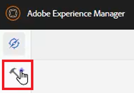

1. Select **Guías** en el panel izquierdo.

1. Haga clic en el [!UICONTROL **Perfiles de carpeta**] mosaico.

   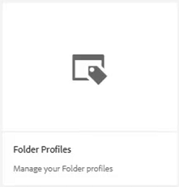

1. Seleccione el perfil que desee. Por ejemplo, elija **Perfil global**, que es el perfil predeterminado.

   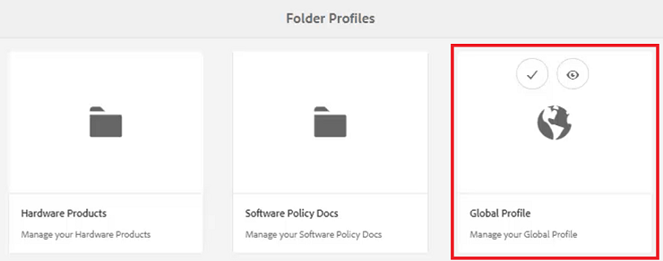

## Editar atributos condicionales en el perfil global

Una vez que haya accedido al Perfil global, puede editar su configuración. La configuración de Perfil global se aplica a todos los usuarios a menos que se especifique lo contrario.

1. En el Perfil global, seleccione la opción **Atributos condicionales** pestaña .

1. Haga clic en [!UICONTROL **Editar**] en la esquina superior izquierda de la pantalla.

   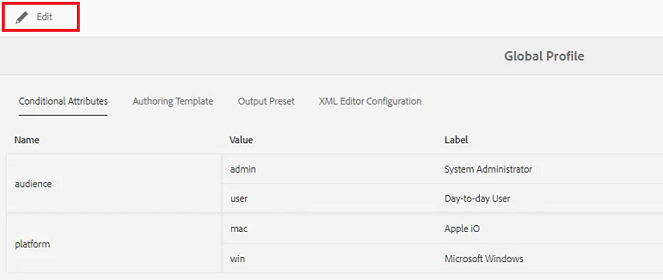

1. Haga clic en [!UICONTROL **Agregar**].

1. Rellene el **Nombre**, **Valor** y **Etiqueta** para la nueva condición.

   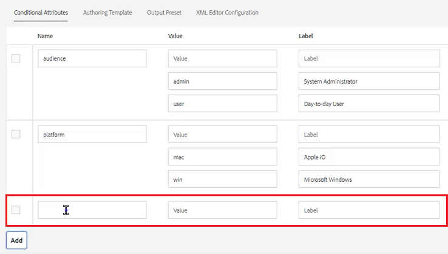

1. Haga clic en [!UICONTROL **Guardar**] en la esquina superior izquierda de la pantalla.
La nueva condición ya está disponible para todos los usuarios. Puede seleccionarlo en el panel Propiedades del contenido y aplicarlo al contenido según sea necesario.

## Crear un nuevo perfil de carpeta

Además del perfil global predeterminado, puede crear sus propios perfiles personalizados.

1. En la pantalla Navegación, haga clic en el [!UICONTROL **Herramientas**] icono.

   

1. Select **Guías** en el panel izquierdo.

1. Haga clic en el [!UICONTROL **Perfiles de carpeta**] mosaico.

   

1. Haga clic en [!UICONTROL **Crear**].

1. En el cuadro de diálogo Crear perfil de carpeta .

   a. Asigne un nombre al perfil.

   b. Especifique una ruta.

   c. Haga clic en [!UICONTROL **Crear**].

   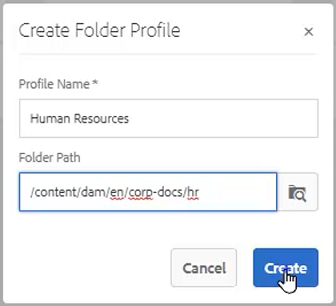

En la página Perfiles de carpeta aparece un mosaico con el nuevo nombre de perfil.

## Agregar usuarios administrativos desde la pestaña General

Los usuarios administrativos tienen derechos para actualizar los Atributos condicionales, la Plantilla de creación y los Ajustes preestablecidos de salida para el Perfil de carpeta.

1. Haga clic en el mosaico para abrir el perfil de carpeta deseado.

   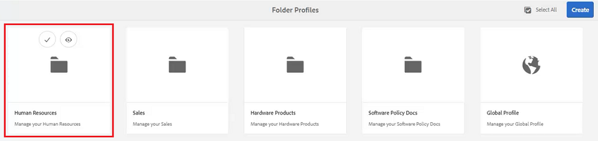

1. Seleccione el **General** pestaña .

1. Haga clic en [!UICONTROL **Editar**] en la parte superior izquierda de la pantalla.

1. En Usuarios administradores, seleccione un usuario de la lista desplegable o escriba el nombre de un usuario.

1. Haga clic en [!UICONTROL **Agregar**].

   Si es necesario, puede agregar varios usuarios administradores.

   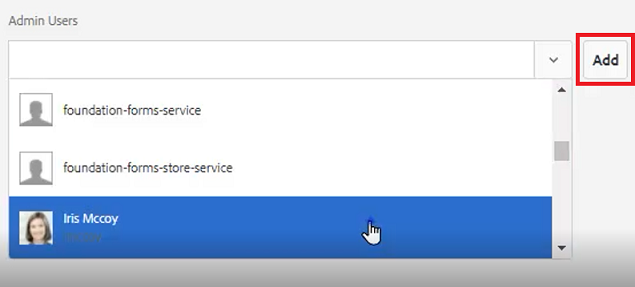

1. Haga clic en [!UICONTROL **Guardar**] en la esquina superior derecha de la pantalla cuando se han agregado todos los usuarios.

Los usuarios administrativos ahora están asignados a este perfil.

## Añadir una nueva audiencia desde la pestaña Atributos condicionales

Una vez que haya accedido al Perfil global, puede editar su configuración. La configuración de Perfil global se aplica a todos los usuarios a menos que se especifique lo contrario.

1. En el perfil de carpeta deseado, seleccione la opción **Atributos condicionales** pestaña .

1. Haga clic en [!UICONTROL **Editar**] en la esquina superior izquierda de la pantalla.

   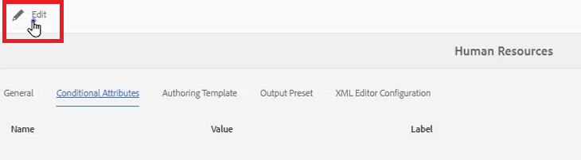

1. Haga clic en [!UICONTROL **Agregar**].

1. Rellene el **Nombre**, **Valor** y **Etiqueta** para la nueva condición.

   Al hacer clic en [!UICONTROL **Más**] permite agregar pares adicionales de valor y etiqueta para el atributo con nombre.

   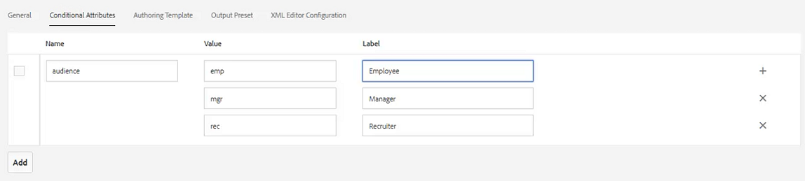

1. Haga clic en [!UICONTROL **Guardar**] en la esquina superior izquierda de la pantalla.

Los nuevos atributos condicionales se han añadido a este perfil.

## Elija una plantilla y una asignación en la ficha Plantillas de creación

AEM guías incluye plantillas y mapas de creación integrados. Puede restringirlos a autores específicos. De forma predeterminada, las plantillas se almacenan en la ubicación Recursos de una carpeta de plantillas DITA.

1. En el perfil de carpeta deseado, seleccione la ficha Plantillas de creación .

1. Haga clic en Editar en la esquina superior izquierda de la pantalla.

1. Agregar una plantilla de mapa.

   a. En el **Plantillas de mapa** , seleccione una opción de los mapas disponibles.

   b. Haga clic en [!UICONTROL **Agregar**].

   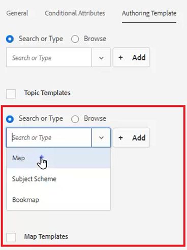

1. Agregar una plantilla de tema.

   a. En el **Plantillas de tema** , seleccione una opción de las plantillas disponibles.

   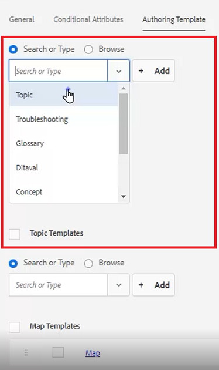

1. Haga clic en [!UICONTROL **Agregar**].

1. Agregue plantillas de tema adicionales según sea necesario.

1. Cuando termine, haga clic en [!UICONTROL **Guardar**] en la parte superior izquierda de la pantalla.

Las nuevas plantillas de creación se han añadido a este perfil.

## Eliminar ajustes preestablecidos no esenciales de la ficha Ajustes preestablecidos de salida

Puede configurar cada ajuste preestablecido de salida en función del perfil de carpeta. Se deben eliminar los ajustes preestablecidos de salida que no sean necesarios.

1. En el perfil de carpeta deseado, seleccione la opción **Ajustes preestablecidos de salida** pestaña .

1. En el panel izquierdo, seleccione las casillas de verificación de los ajustes preestablecidos que no sean necesarios.

   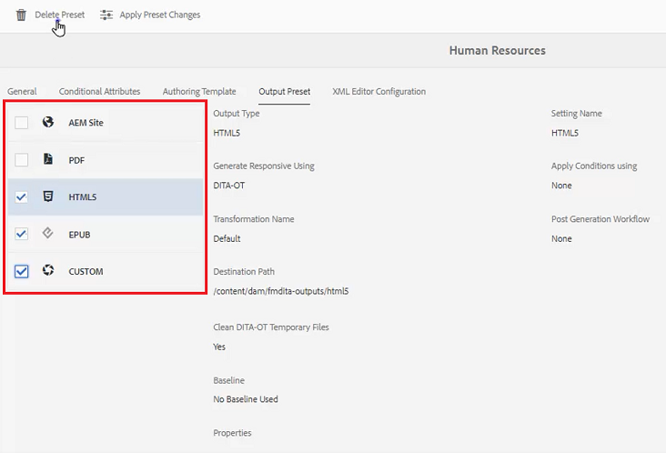

1. Haga clic en [!UICONTROL **Eliminar ajuste preestablecido**] en la esquina superior izquierda de la pantalla.

1. En el cuadro de diálogo Eliminar ajuste preestablecido, haga clic en [!UICONTROL **Eliminar**].

   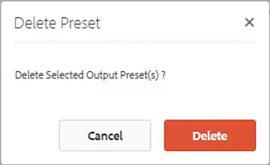

Ahora, los únicos ajustes preestablecidos de salida que se muestran son los que se utilizarán.

## Cargar un fragmento desde la ficha Configuración del Editor XML

1. En el perfil de carpeta deseado, seleccione la opción **Configuración del Editor XML** pestaña .

1. En Fragmentos del Editor XML, haga clic en [!UICONTROL **Cargar**].

   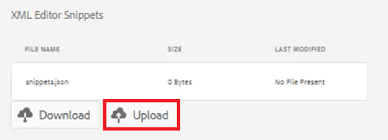

1. Vaya a un fragmento creado anteriormente.

1. Haga clic en [!UICONTROL **Apertura**].

1. Haga clic en [!UICONTROL **Guardar**] en la parte superior izquierda de la pantalla.

Ha modificado correctamente la configuración del editor para incluir fragmentos.

## Especifique el perfil de carpeta en el repositorio

En el Editor, puede ver los resultados de las modificaciones realizadas en los Perfiles de carpeta.

1. Vaya a **Vista del repositorio**.

1. Haga clic en la carpeta del contenido con el que desea trabajar.

1. Haga clic en el [!UICONTROL **Preferencias de usuario**] en la barra de herramientas superior.

   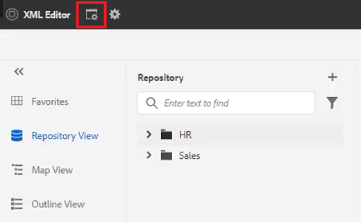

1. En el cuadro de diálogo Preferencias de usuario, seleccione el perfil de carpeta que desee en la lista desplegable.

   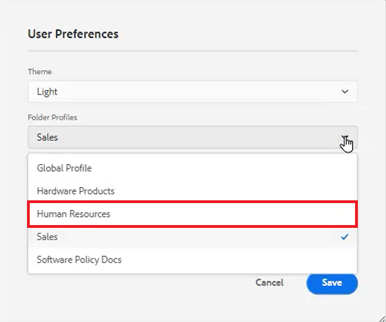

1. Haga clic en [!UICONTROL **Guardar**].

Ha aplicado el perfil de carpeta a su contenido. Ahora, cuando cree un nuevo tema DITA, verá una lista restringida de tipos de tema basados en el perfil de carpeta. La condición de audiencia contiene la configuración global y las específicas del perfil de carpeta. El archivo de fragmentos que ha cargado creó un conjunto de fragmentos de texto predeterminados entre los que elegir. El panel Mapa muestra los ajustes preestablecidos de salida restringidos.
