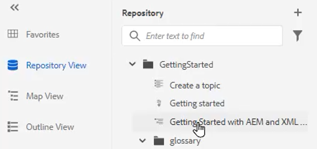
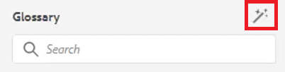

# Glosario

El panel Glosario permite analizar un mapa. Puede crear un archivo de tema de Glosario e incluirlo en un mapa de Glosario común. Este mapa se puede añadir a otros mapas. El uso del Glosario facilita la expresión coherente de la información y proporciona una mejor claridad al lector.

Los archivos de muestra que puede utilizar para esta lección se proporcionan en el archivo . [glossary.zip](assets/glossary.zip).

>[!VIDEO](https://video.tv.adobe.com/v/342765?quality=12&learn=on)

## Agregar una entrada de glosario a un tema

1. Vaya a la **Glosario** panel.

1. Arrastre y suelte la entrada desde el **Glosario** a la ubicación deseada en el tema.

Si el mapa contiene entradas de Glosario y está configurado correctamente, los temas se pueden actualizar automáticamente para que contengan un formulario abreviado.

## Especificar un mapa raíz

El mapa raíz correcto debe estar seleccionado para que funcione correctamente con un glosario. Cuando un mapa raíz encuentra entradas de Glosario, estas se muestran en el panel Glosario.

1. Con un tema abierto, seleccione **Glosario** del panel izquierdo.

1. Haga clic en el [!UICONTROL **Preferencias de usuario**] en la barra de herramientas superior.

   

1. Haga clic en el icono de clave para especificar el mapa raíz correcto para trabajar con el glosario.

1. Haga clic en [!UICONTROL **Select**].

1. Haga clic en [!UICONTROL **Guardar**].

El panel Glosario se actualiza automáticamente.

## Trabajar con el Glosario

1. Vaya a la **Vista del repositorio**.

1. Seleccione el mapa que se ha preconfigurado para trabajar con el glosario.

   

1. Elija la [!UICONTROL **Vista Mapa**].

1. Compruebe que la Vista de mapa muestra los temas necesarios.

## Vista previa de una entrada de glosario

Debido a que es posible realizar cambios masivos, puede ser importante obtener una vista previa de una entrada de glosario.

1. Choose **Glosario** del panel izquierdo.

1. Haga clic en el menú contextual junto a una entrada de glossentry y seleccione [!UICONTROL **Vista previa**].

Se muestran tanto el formulario abreviado como la definición del glosario.

## Revisar la configuración de la herramienta de puntos interactivos

Utilice la herramienta Zona interactiva para crear una colección completa de entradas del glosario a partir de un solo mapa. Incluso puede buscar y convertir términos de texto específicos en abreviaciones de Glosario vinculadas.

1. En el panel Glosario, seleccione la opción [!UICONTROL **Icono de zona interactiva**].

   

1. Haga clic en el [!UICONTROL **Claves de glosario**] y seleccione solo las claves que desee aplicar.

1. Haga clic en el [!UICONTROL **Temas**] para seleccionar el contenido que debe verse afectado.

1. Haga clic en el [!UICONTROL **Filtrar temas por estado**] para revisar las opciones configuradas.

1. Configure las demás opciones según sea necesario.

1. Cuando termine, haga clic en [!UICONTROL **Convertir**].

El panel Glosario ahora muestra todos los temas actualizados y también los temas con errores.
