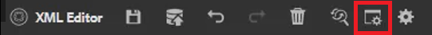

# Glosario

El panel Glosario permite analizar un mapa. Puede crear un archivo de tema del glosario e incluirlo en un mapa del glosario común. Este mapa se puede añadir a otros mapas. El uso del glosario facilita la expresión coherente de la información y proporciona una mejor claridad al lector.

En el archivo se proporcionan archivos de ejemplo que puede optar por utilizar para esta lección [glossary.zip](assets/glossary.zip).

>[!VIDEO](https://video.tv.adobe.com/v/342765?quality=12&learn=on)

## Agregar una entrada del glosario a un tema

1. Vaya a **Glosario** panel.

1. Arrastre y suelte la entrada desde el **Glosario** panel a la ubicación deseada en el tema.

Si el mapa contiene entradas de Glosario y está configurado correctamente, los temas se pueden actualizar automáticamente para contener el formulario abreviado.

## Especificar un mapa raíz

Se debe seleccionar el mapa raíz correcto para que funcione correctamente con un glosario. Cuando un mapa raíz encuentra entradas de glosario, estas se muestran en el panel Glosario.

1. Con un tema abierto, seleccione **Glosario** en el panel izquierdo.

1. Haga clic en [!UICONTROL **Preferencias de usuario**] en la barra de herramientas superior.

   

1. Haga clic en el icono de tecla para especificar el mapa raíz correcto para trabajar con el glosario.

1. Clic [!UICONTROL **Seleccionar**].

1. Haga clic en [!UICONTROL **Guardar**].

El panel Glosario se actualiza automáticamente.

## Trabajar con el glosario

1. Vaya a **Vista de repositorio**.

1. Seleccione el mapa que se ha preconfigurado para trabajar con el glosario.

   

1. Elija la [!UICONTROL **Vista de mapa**].

1. Compruebe que la Vista de mapa muestra los temas necesarios.

## Previsualizar una entrada de glosario

Dado que es posible realizar cambios masivos, puede ser importante previsualizar una entrada de glossentry.

1. Elegir **Glosario** en el panel izquierdo.

1. Haga clic en el menú contextual junto a una entrada de glosario y seleccione [!UICONTROL **Previsualizar**].

Tanto la forma abreviada como la definición del glosario se muestran.

## Revisar configuración de herramienta de punto interactivo

Utilice la herramienta de punto interactivo para crear una colección completa de entradas del glosario a partir de un solo mapa. Incluso puede buscar y convertir términos de texto específicos en abreviaturas de glosario vinculadas.

1. En el panel Glosario, seleccione [!UICONTROL **Icono de punto interactivo**].

   

1. Haga clic en [!UICONTROL **Claves de glosario**] y seleccione solo las claves que desee aplicar.

1. Haga clic en [!UICONTROL **Temas**] para seleccionar el contenido que debería verse afectado.

1. Haga clic en [!UICONTROL **Filtrar temas por estado**] desplegable para revisar las opciones configuradas.

1. Configure los ajustes restantes según sea necesario.

1. Cuando termine, haga clic en [!UICONTROL **Convertir**].

El panel Glosario ahora muestra todos los temas actualizados y también los temas con errores.
