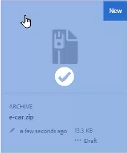
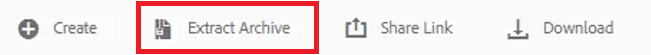
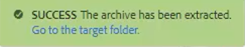
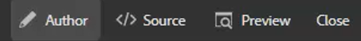
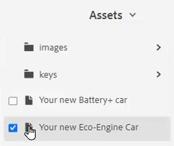
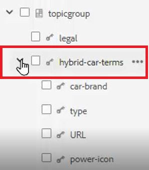
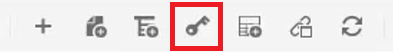
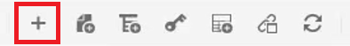
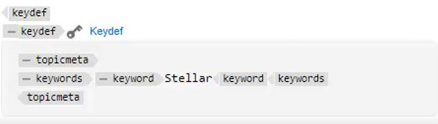

# Claves

Diferentes conjuntos de materiales pueden contener información similar que debe personalizarse en lugares seleccionados. Las claves permiten incluir información de variables en al trabajar con DITA.

En el archivo se proporcionan archivos de ejemplo que puede optar por utilizar para esta lección [keys.zip](assets/keys.zip).

>[!VIDEO](https://video.tv.adobe.com/v/342756?quality=12&learn=on)

## Habilitar claves

1. Cargue el conjunto de archivos de ejemplo proporcionados.

   a. Cargue el archivo zip.

   AEM b. Actualice el entorno de la.

   c. Seleccione el archivo que desea extraer.

   

   d. Haga clic [!UICONTROL **Extraer archivo**] en la barra de herramientas superior.

   

   e. En el cuadro de diálogo, elija la ubicación específica de los archivos que desea extraer, como una carpeta denominada Claves.

   f. Haga clic [!UICONTROL **Siguiente**].

   g. Omita los conflictos, ya que no existirán para contenido que nunca se haya cargado antes.

   h. Seleccione [!UICONTROL **Extract**] en la parte superior derecha de la pantalla.

1. Cuando finalice la extracción, haga clic en [!UICONTROL **Ir a la carpeta de destino**].

   

## Resolver claves de valores referenciados

Para utilizar correctamente las claves, las preferencias de usuario deben hacer referencia a un mapa específico como mapa raíz. Dentro de este mapa hay una colección de Keys, agrupadas dentro de un grupo de temas. Al abrir el mapa y los temas, se resuelven las Claves en los valores a los que hace referencia este mapa.

1. Especifique un mapa raíz.

   a. En la pantalla Teclas, abra un mapa.

   b. Configure las preferencias de usuario.

   c. Haga clic en [!UICONTROL **Preferencias de usuario**] en la barra de herramientas superior.

   

   d. Haga clic en el icono de tecla para especificar una **Mapa raíz** que se utilizará para resolver Keys.

   e. Seleccione las casillas de verificación de los recursos que desee.

   

   f. Haga clic [!UICONTROL **Seleccionar**].

   g. **Guardar** las Preferencias de usuario.

1. Vaya a **Vista de mapa**.

1. Abra el mapa especificado.

Las claves se han resuelto.

## Agregar una nueva definición de clave manualmente

1. Abra un mapa con un mapa raíz especificado.

1. Seleccione una clave.

   

1. Inserte una nueva definición de clave.

   a. Haga clic en una ubicación válida del mapa.

   b. Seleccione la **Keydef** en la barra de herramientas superior.

   

   c. En el cuadro de diálogo Insertar definición de clave, escriba un valor único para Claves que tenga sentido para la definición que está creando.

   d. Haga clic [!UICONTROL **Insertar**].

1. Agregue tema meta dentro de keydef.

   a. Haga clic en [!UICONTROL **Insertar elemento**] en la barra de herramientas superior.

   

   b. En el diálogo Insertar elemento, busque y seleccione &quot;topicmeta&quot;.

1. Añada palabras clave dentro del tema meta.

   a. Haga clic en [!UICONTROL **Insertar elemento**] en la barra de herramientas superior.

   

   b. En el diálogo Insertar elemento, busque y seleccione &quot;palabras clave&quot;.

1. Añada una palabra clave dentro del tema meta.

   a. Haga clic en [!UICONTROL **Insertar elemento**] en la barra de herramientas superior.

   

   b. En el **Insertar elemento** , busque y seleccione &quot;palabra clave&quot;

1. Escriba el valor de keydef en la palabra clave.

En el mapa, la definición de clave debería tener un aspecto similar al siguiente:

## Configurar una definición de clave como un fragmento

Los fragmentos de código son pequeños fragmentos de contenido que se pueden reutilizar en varios temas del proyecto de documentación. En lugar de generar manualmente cada keydef, puede configurar un solo keydef como un fragmento.

1. Seleccione un elemento keydef del mapa.

1. En el menú contextual, haga clic en [!UICONTROL **Crear fragmento**].

1. En el cuadro de diálogo Nuevo fragmento de código, agregue un Título y una Descripción.
También es posible que desee eliminar del Contenido las claves o definiciones de palabras clave existentes.

1. Haga clic en [!UICONTROL **Crear**].

1. En el panel izquierdo, seleccione **Fragmentos**.

1. Arrastre y suelte el fragmento que acaba de crear desde el panel Fragmentos de código hasta el mapa.

1. Actualice keydef según sea necesario mediante Propiedades de contenido.
Cuando se guarde y actualice, este conjunto de claves estará disponible para cualquier usuario que haya definido una asignación que contenga el mismo mapa raíz.
