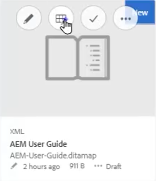
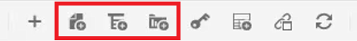
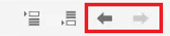
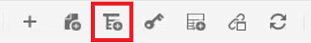
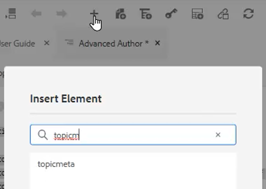
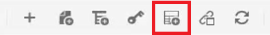
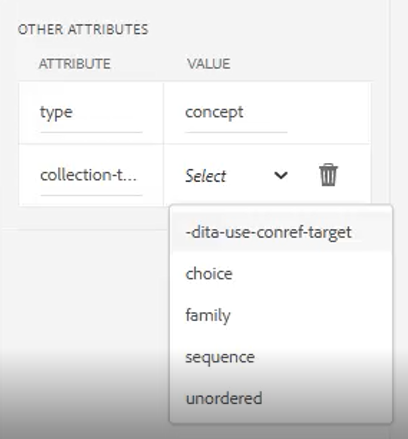

# Mapas y marcadores

El Editor de mapas de las guías de Adobe Experience Manager le permite crear y editar archivos de mapa. Con el Editor de mapas, puede editar dos tipos de archivos: Mapa DITA y Mapa de libros. Para nuestros propósitos, consideremos que estos son conceptos ampliamente intercambiables.
El Editor de mapas viene en dos modos: el Editor de mapas básico y el Editor de mapas avanzado.

>[!VIDEO](https://video.tv.adobe.com/v/342766?quality=12&learn=on)

## Creación de un mapa

AEM Guías proporciona dos plantillas de mapa predeterminadas: Mapa DITA y Mapa de libros. También puede crear sus propias plantillas de asignación y compartirlas con sus autores para crear archivos de asignación.

Realice los siguientes pasos para crear un archivo de asignación.

1. En la interfaz de usuario de Assets, vaya a la ubicación en la que desea crear el archivo de asignación.

2. Haga clic en [!UICONTROL **Crear > Mapa DITA**].

3. En la página Modelo, seleccione el tipo de plantillas de mapa que desee utilizar y haga clic en [!UICONTROL **Siguiente**].

4. En la página Propiedades , introduzca un **Título** y **Nombre** para el mapa.

5. Haga clic en [!UICONTROL **Crear**].

## Apertura de un mapa con el Editor de mapas avanzado

1. En el **IU de recursos**, seleccione el mapa que desea editar.

2. Haga clic en [!UICONTROL **Editar temas**].

   

O bien

1. Pase el ratón sobre el icono del mapa.

2. Select **Editar temas** de la variable **Acción** para abrir el Navegador.

## Adición de contenido a un mapa o a un mapa

1. Vaya a la **Vista del repositorio**.

2. Arrastre y suelte el contenido de la vista Repositorio en ubicaciones válidas del mapa o del mapa de libros.

O bien

1. Haga clic en una ubicación válida dentro del mapa o del mapa de libros.

2. Haga clic en el [!UICONTROL **Icono de barra de herramientas**] para agregar capítulos, temas o temas.

   

3. Elija uno o varios recursos que desee agregar.

4. Haga clic en [!UICONTROL **Select**].

### Promocionar o degradar elementos en un mapa

Uso **Flechas de la barra de herramientas** para promocionar o degradar capítulos y topicrefs en un mapa o mapa de libros.

1. Seleccione un elemento en el mapa.

2. Haga clic en el [!UICONTROL **Flecha izquierda**] para promocionar un tema a un capítulo, o [!UICONTROL **Flecha derecha**] para pasar de un capítulo a un topicref.

   

3. Guarde y revise la versión del mapa si es necesario.

O bien

1. Arrastre y suelte los elementos para reorganizarlos.

## Añadir metadatos a un mapa

1. En el **Barra de herramientas Mapa**, inserte un grupo de temas.

   

2. Haga clic en el [!UICONTROL **Icono Más**] para insertar elementos.

3. Elija los elementos que desea insertar.

   

4. Haga clic en [!UICONTROL **Cerrar**].

## Adición de una tabla nueva a un mapa

Se puede agregar una tabla relacional después de estructurar un mapa.

1. Haga clic en el mapa donde desee insertar la tabla de cambios.

2. Utilice la variable **Icono de barra de herramientas** para añadir la tabla de correspondencias al mapa.

   

3. Configure el cuadro de diálogo.

4. Haga clic en [!UICONTROL **Insertar**].

5. Arrastre y suelte los temas requeridos desde la **Repositorio** en el reltable.

6. Copie y pegue los elementos requeridos del mapa en la tabla relacional mediante métodos abreviados de teclado estándar.

## Asignar atributos a los topicrefs en un mapa

1. Resalte un topicref o una colección anidada de topicrefs en el mapa.

2. En Otros atributos del panel Propiedades de contenido, elija un **Atributo** y **Valor.**

   
