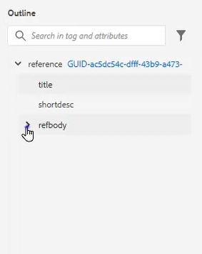
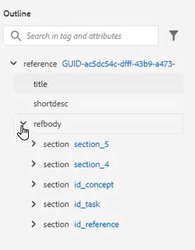
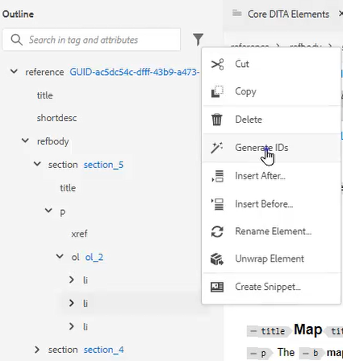
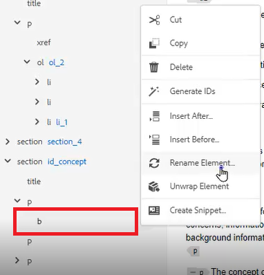
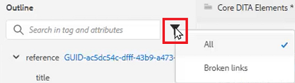
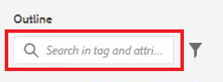

# Vista Esquema

La vista Esquema proporciona una amplia gama de opciones de compatibilidad al trabajar con un documento estructurado. Expanda y contraiga la vista, navegue por la estructura, trabaje con Atributos (por ejemplo, para crear un nuevo ID) y reorganice, desajuste y reestructura los elementos haciendo clic en un botón.

>[!VIDEO](https://video.tv.adobe.com/v/342767?quality=12&learn=on)

## Expandir y contraer la vista Esquema

Los elementos se pueden expandir para mostrar elementos secundarios o contraer según sea necesario.

1. Haga clic en el icono correspondiente para expandir o contraer la vista Esquema.

   

   

La vista Esquema cambia de expandida a contraída.

## Desplazamiento mediante la vista Esquema

1. Haga clic en cualquier elemento para saltar a esa ubicación.

1. Haga clic en [!UICONTROL **Puntos suspensivos**] situado junto a un elemento para acceder a las opciones de acceso directo.

   

## Asignar un ID con la vista Esquema

Se puede generar automáticamente un nuevo ID en función de la configuración del sistema. Mediante las Propiedades de contenido, el ID y su Valor también se pueden actualizar si es necesario.

1. Haga clic en [!UICONTROL **Puntos suspensivos**] junto a cualquier elemento.

1. Elegir **Generación de ID**.

   

Se asigna el ID de. Se actualiza Propiedades de contenido y se muestra información de elementos y atributos.

## Reorganizar elementos arrastrando y soltando

Los elementos se pueden reordenar en la vista Esquema.

1. Haga clic en un elemento y arrástrelo a otra ubicación en la vista Esquema.

1. Suelte el elemento encima de otro elemento para reemplazarlo. Esta acción se indica mediante un cuadro cuadrado alrededor del elemento que se va a reemplazar.

   O bien

   Coloque el elemento entre otros dos elementos para cambiar su ubicación. Esta acción se indica mediante una línea entre elementos donde se suelta el nuevo elemento.

## Cambiar nombre de elemento

1. Seleccione el elemento.

1. Haga clic en [!UICONTROL **Puntos suspensivos**].

1. Seleccionar **Cambiar nombre de elemento**.

   

1. Haga doble clic en un nuevo nombre de elemento.

Se ha cambiado el nombre del elemento.

## Desenvolver un elemento

1. Seleccione el elemento que desea desajustar.

1. Haga clic en [!UICONTROL **Puntos suspensivos**].

1. Seleccionar [!UICONTROL **Desenvolver elemento**].

El contenido permanece, pero la estructura se ha eliminado.

## Filtrado de contenido mediante la vista Esquema

1. Haga clic en [!UICONTROL **Filtrar**] situado junto a la barra de búsqueda en la vista Esquema.

   

1. Elija una de estas opciones **Todo** para mostrar todos los elementos o **Vínculos rotos** para buscar y corregir referencias rotas.

## Buscar con vista de esquema

Una búsqueda puede estar restringida y devolver resultados basados en un elemento, atributo o valor.

1. Escriba el nombre del elemento que desea buscar en la barra de búsqueda.

   

1. Elija el resultado que sea más relevante para sus necesidades.
