# Paneles

El Editor web de guías de AEM se divide en varias secciones, incluidas una barra de herramientas principal, una barra de herramientas secundaria, un panel izquierdo, un área de edición de contenido y un panel derecho.

>[!VIDEO](https://video.tv.adobe.com/v/342760?quality=12&learn=on)

## Cambiar el tamaño del panel izquierdo

Los paneles persistentes, como el panel izquierdo, son ajustables en tamaño.

1. Coloque el cursor en el borde del panel.

1. Cuando aparezca la flecha con dos puntas, haga clic y arrastre hacia dentro o hacia fuera, según sea necesario.

## Expandir o contraer la barra lateral del panel izquierdo

La vista expandida muestra los nombres y los iconos que aparecen como Consejos de herramientas en la vista contraída.

1. Haga clic en el [!UICONTROL **Barra lateral**] para expandir el panel.

   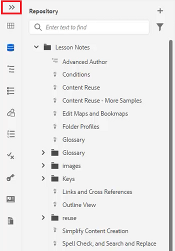

1. Haga clic en el [!UICONTROL **Barra lateral**] para contraer el panel.

   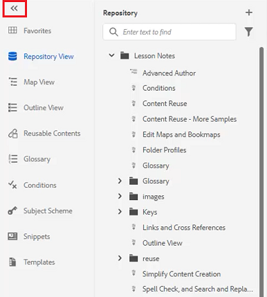

## Crear una colección de Favoritos

En el panel izquierdo, Favoritos le permite crear una lista de documentos específicos y añadirlos a lo largo del tiempo. Puede crear y administrar una amplia colección de Favoritos.

1. Select **Favoritos** en el panel izquierdo.

1. Haga clic en el [!UICONTROL **Más**] icono.

   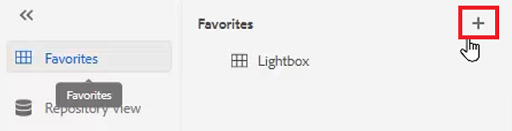

1. En el cuadro de diálogo Nueva colección, introduzca un **Título** y **Descripción**.

   Tenga en cuenta que seleccionar Público significa que otros usuarios pueden ver este Favorito.

1. Haga clic en [!UICONTROL **Crear**].

Ahora ha creado una colección de Favoritos.

## Agregar un archivo a una colección de Favoritos desde el repositorio

Después de crear una colección, puede empezar a agregarle Favoritos.

1. Select **Vista del repositorio** en el panel izquierdo.

1. Haga clic en el [!UICONTROL **Elipsis**] situado junto a un tema para acceder a las opciones contextuales.

1. Select **Agregar a** > **Favoritos**.

1. En el cuadro de diálogo Agregar a favoritos, elija **Nueva colección** o **Colección existente**.

   Aquí, elegiremos agregar a una colección existente.

   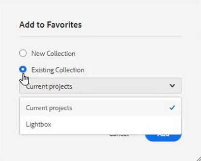

1. Si es necesario, seleccione una colección en la lista desplegable.

1. Haga clic en [!UICONTROL **Agregar**].

El tema se agregará a la colección Favoritos que haya elegido. Puede verlo en el menú Favoritos .

## Agregar un archivo a una colección de Favoritos desde el Editor

Otra forma de agregar un tema a Favoritos es a partir de un tema abierto en el Editor.

1. Vaya a la **Vista del repositorio**.

1. Haga doble clic en un tema para abrirlo.

1. Haga clic con el botón derecho en el **Ficha Título** en el Editor para acceder a las opciones contextuales.

1. Choose **Agregar a** > **Favoritos**.

   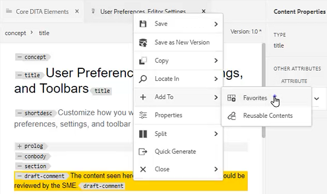

1. En el cuadro de diálogo Agregar a favoritos, elija **Nueva colección** o **Colección existente**.

   Aquí, elegiremos agregar a una nueva colección.

1. En el cuadro de diálogo Nueva colección, introduzca un **Título** y **Descripción**.

   Tenga en cuenta que al seleccionar **Público** significa que otros usuarios pueden ver este Favorito.

1. Haga clic en [!UICONTROL **Crear**].

El nuevo favorito se ha creado y agrupado. Puede verlo en el menú Favoritos .

## Ver y administrar sus favoritos

Es fácil ver qué temas ya agregó a sus colecciones de Favoritos.

1. Select [!UICONTROL **Favoritos**] en el panel izquierdo.

1. En Favoritos, haga clic en el [!UICONTROL **Flecha**] junto a una colección para ver su contenido.

   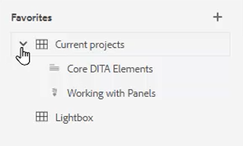

1. Haga clic en el [!UICONTROL **Elipsis**] junto a un tema para que aparezcan opciones contextuales, incluida la opción para eliminarla de la lista Favoritos.

## Filtrar una búsqueda en la vista Repositorio

El filtro mejorado del Repositorio le permite buscar texto con una amplia variedad de restricciones.

1. Vaya a **Vista del repositorio**.

1. Haga clic en el [!UICONTROL **Filtrar búsqueda**] icono.

   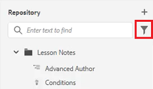

1. Escriba el texto en la ruta seleccionada o elija una ruta nueva si es necesario.

   La lista de archivos se actualiza a medida que escribe texto en el filtro.

1. Haga clic en el icono de flecha situado junto a una categoría de búsqueda para limitar aún más la búsqueda si es necesario.

   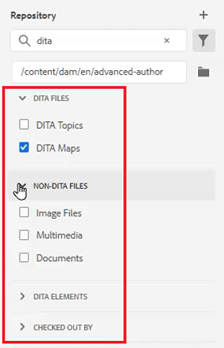

Las búsquedas se pueden restringir a temas DITA o mapas DITA. Puede buscar archivos de imagen no DITA, multimedia u otros documentos dentro de la ruta seleccionada. Incluso puede restringir la búsqueda a Elementos DITA o filtrar por archivo de cierre de compra.

## Explorar la vista Mapa

En la vista Mapa hay disponibles varias funciones útiles, incluida la posibilidad de cerrar y bloquear archivos, obtener una vista previa del archivo de mapa, abrir el panel Mapa y ver el mapa en la interfaz de usuario de Assets.

Consulte la lección titulada [Mapas y marcadores](./maps-and-bookmaps.md) en este curso para obtener más información sobre la vista Mapa y su funcionalidad.

## Explorar la vista Esquema

La vista Esquema proporciona una vista jerárquica del documento actual en el Esquema. Puede expandir la vista de esquema para mostrar varios elementos, así como cualquier ID asignado.

Consulte la lección titulada [Vista Esquema](./outline-view.md) en este curso para obtener más información sobre la vista de esquema y su funcionalidad.

## Trabajar con contenido reutilizable

La función principal de DITA es la capacidad de reutilizar contenido, desde frases pequeñas hasta temas completos o mapas. El Editor proporciona una interfaz de arrastrar y soltar para la reutilización de contenido.

Consulte la lección titulada [Reutilización de contenido](./content-reuse.md) en este curso para obtener más información sobre contenido reutilizable y cómo administrarlo de forma eficaz.

## Trabajar con glosarios

El uso del Glosario facilita la expresión coherente de la información y proporciona una mejor claridad al lector. El Editor proporciona una interfaz de arrastrar y soltar para insertar términos de glosario en un tema.

Consulte la lección titulada [Glosario](./glossary.md) en este curso para obtener más información sobre cómo configurar y utilizar glosarios.

## Trabajar con condiciones

En DITA, las condiciones suelen impulsarse mediante el uso de atributos como Producto, Plataforma y Audiencia, que pueden tener asignados valores específicos a cada uno. Las condiciones se administran mediante Perfiles de carpeta.

Consulte la lección titulada [Condiciones](./conditions.md) en este curso para obtener más información sobre cómo configurar y utilizar atributos condicionales.

## Crear un fragmento

Los fragmentos son pequeños fragmentos de contenido que se pueden reutilizar como punto de partida para el contenido o la estructura. El uso de recortes reduce la cantidad de tiempo necesario para crear contenido y mejora la calidad estructural y la coherencia de los materiales.

1. Abra un tema en el Editor.

1. Seleccione un elemento dentro del tema.

1. Haga clic en el botón secundario del ratón dentro del elemento .

1. En el menú resultante, seleccione Crear [!UICONTROL **Fragmento**].

   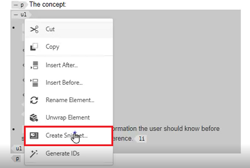

1. En el cuadro de diálogo Nuevo fragmento, agregue una **Título** y **Descripción**.

1. Edite el fragmento según sea necesario.

   Tenga en cuenta que una comprobación contextual le avisará visualmente si introduce un error en el contenido.

1. Haga clic en [!UICONTROL **Crear**].

El fragmento se añade a la lista de fragmentos de texto disponibles. Está listo para arrastrarse y soltarse en una ubicación válida del tema.

## Trabajar con plantillas

Con el panel Plantillas, los administradores pueden crear y administrar fácilmente plantillas para que las utilicen los autores. De forma predeterminada, las plantillas se clasifican como de tipo Mapa y Tema.

Consulte las lecciones tituladas [Perfiles de carpeta](./folder-profiles.md) y [Flujos de trabajo para la creación de contenido simple](simple-content-creation-workflows.md) en este curso para obtener más información sobre cómo configurar y aplicar plantillas.

## Buscar archivos con Buscar y reemplazar

Hay dos opciones de Buscar y reemplazar disponibles en el Editor. La primera permite las funciones Buscar y reemplazar dentro de un tema abierto específico, como un procesador de palabras tradicional. El segundo es un panel Buscar y reemplazar que busca texto en varios archivos del Repositorio.

Consulte la lección titulada [Revisar ortografía y buscar y reemplazar](./spell-check.md)  en este curso para obtener más información sobre la función Buscar y reemplazar .

## Actualizar propiedades de contenido

Las Propiedades de contenido del panel derecho incluyen información específica sobre el elemento seleccionado actualmente, por ejemplo, el ID de atributo y el valor.

1. Abra un tema en **Editor XML**.

1. Seleccione un **element**.

   Propiedades de contenido muestra el tipo y los atributos actuales del elemento.

1. Escriba un nuevo **Valor** para el elemento .

   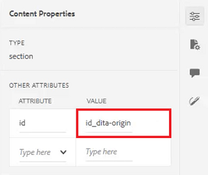

Las propiedades de contenido se actualizan de forma dinámica a medida que se realizan cambios en los elementos.

## Adición de un tema a un mapa mediante Propiedades de archivo

Propiedades del archivo muestra información adicional sobre todo el tema abierto. Parte de esta información está controlada por Propiedades del tema. Las modificaciones realizadas en otros materiales, como el Estado del documento, pueden depender de los permisos.

1. Abra un tema en el Editor.

1. Haga clic en el [!UICONTROL  **Propiedades del archivo**] en el panel derecho.

   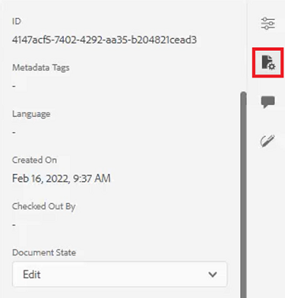

1. Configure las variables **Estado del documento** a **Editar**. Tenga en cuenta que la lista Referencias está actualmente en blanco.

   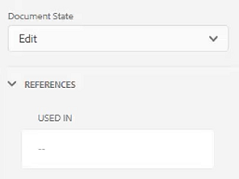

1. Cierre el tema.

1. Select [!UICONTROL **Vista del repositorio**] en el panel izquierdo.

1. Abra un mapa.

   La vista cambia a Vista de mapa.

1. Haga clic en el [!UICONTROL **Editar**] icono.

   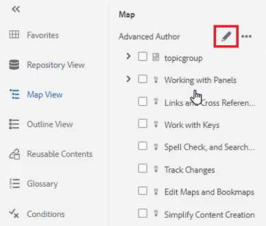

1. Una vez que el mapa esté abierto para edición, vuelva a cambiar a **Vista del repositorio**.

1. Arrastre y suelte el tema con el que está trabajando en el mapa.

1. Haga clic en el [!UICONTROL **Guardar**] en la barra de herramientas superior.

El tema se agrega al mapa. Ahora, al abrir el tema y comprobar las Propiedades del archivo, puede ver que las Referencias se actualizan para reflejar que el tema se utiliza en el mapa especificado.

## Crear una tarea de revisión

El panel derecho contiene un método abreviado para iniciar un flujo de trabajo de revisión.

1. Haga clic en el [!UICONTROL **Consulte**] en el panel derecho.

   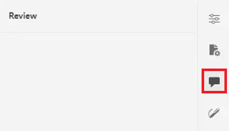

1. Haga clic en [!UICONTROL **Crear revisión**].

   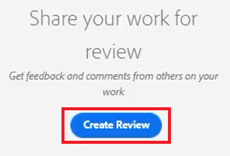

1. En el cuadro de diálogo Crear tarea de revisión , rellene los campos como sea necesario.

1. Haga clic en [!UICONTROL **Siguiente**].

Se crea la tarea de revisión.

## Seguimiento de cambios

La capacidad de realizar un seguimiento de los cambios proporciona un bueno control sobre los cambios que se conservan en una versión de un tema a la siguiente. Puede utilizar el panel derecho para administrar los cambios rastreados.

Consulte la lección titulada [Seguimiento de cambios](./track-changes.md) en este curso para obtener más información sobre la funcionalidad de seguimiento de cambios.
