# Flujos de trabajo para la creación de contenido simple

El Editor de guías de AEM tiene varios métodos abreviados que simplifican el flujo de trabajo de creación de contenido. Estos accesos directos permiten a los usuarios agregar y modificar rápidamente imágenes, trabajar con varios temas a la vez, corregir errores, descargar PDF de temas y trabajar con versiones y etiquetas.

>[!VIDEO](https://video.tv.adobe.com/v/342770?quality=12&learn=on)

## Añadir una imagen

Las imágenes se pueden agregar directamente desde una unidad local.

1. Arrastre y suelte la imagen directamente en el tema. La variable **Cargar recursos** se abre.

   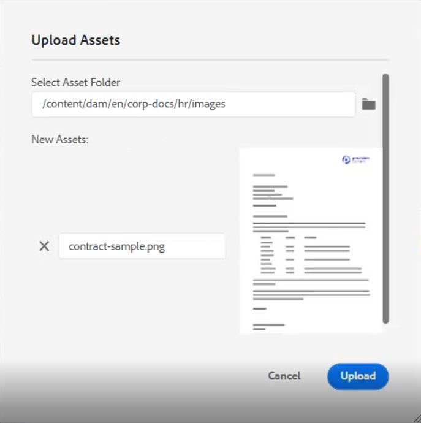

1. Modifique la ruta de la carpeta a la ubicación de la imagen que desee.

1. Cambie el nombre de la imagen por otro que sea representativo de su propósito.

1. Haga clic en [!UICONTROL **Cargar**].

## Modificar una imagen

1. Cambie el tamaño de una imagen arrastrando y soltando una esquina.

1. Mueva una imagen a otra ubicación dentro del tema arrastrándola y soltándola.

1. Uso **Propiedades de contenido** en el panel lateral derecho para modificar el

   - scale

   - position

   - alineación, o

   - otros atributos.

   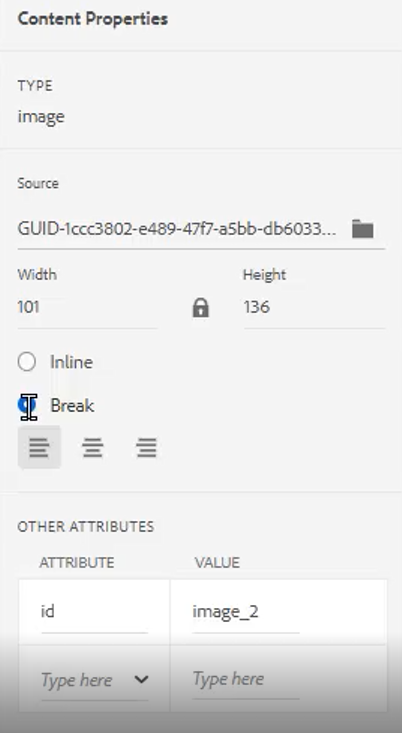

## Trabajar con varios temas

La vista dividida resulta útil cuando se comparan temas, se copian y se pegan entre temas o se arrastra y se suelta contenido de un tema a otro.

1. Abra dos o más temas relacionados.

1. Haga clic en la ficha Título de un archivo para abrir el menú contextual.

1. Select [!UICONTROL **Split**].

1. Choose **Right**.

   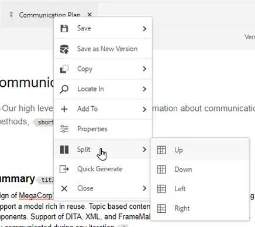

## Corrección de errores tipográficos

1. Busque la palabra o frase que contenga el error.

1. Presione y mantenga presionada la tecla [!UICONTROL **Ctrl**].

1. Haga clic en el botón secundario del ratón en el error.

1. Seleccione la ortografía correcta.

El error se ha corregido en el texto del tema.

## Descargar un PDF de temas

Es posible que los usuarios deseen descargar un PDF del tema actual para marcarlo o compartirlo con otros.

1. Haga clic en [!UICONTROL **Vista previa**] en la parte superior derecha de la pantalla.

1. Haga clic en el [!UICONTROL **PDF**] encima del tema. Aparece un cuadro de diálogo.

   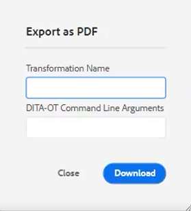

1. Rellene la información para **Nombre de transformación** o **Argumentos de la línea de comandos DITA-OT** si es necesario. Tenga en cuenta que se seguirá generando un PDF si todos los campos se dejan en blanco.

1. Haga clic en [!UICONTROL **Descargar**]. El PDF genera.

1. Utilice los iconos disponibles para configurar, descargar o compartir el tema del PDF.

## Localización de un tema en el Repositorio o Mapa

1. Abra el tema .

1. Haga clic en el botón secundario del ratón en la ficha Título.

1. Select **Localizar en**.

1. Elija una de las opciones siguientes: **Repositorio** o **Mapa** para ir a la ubicación del tema que desee.

## Versión de un tema

1. Realice un cambio en un tema.

1. Guarde el tema.

1. Haga clic en el **Repositorio** en el menú superior izquierdo.

   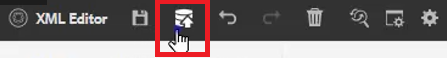

1. En el cuadro de diálogo, agregue **Comentarios para la nueva versión**.

   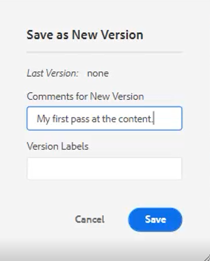

1. Haga clic en [!UICONTROL **Guardar**].

El número de versión se actualiza.

## Cargar etiquetas de versión

Puede resultar difícil intentar rastrear el estado de un tema basándose únicamente en el número de versión. Las etiquetas facilitan la identificación del estado exacto de un tema que ha sufrido varias revisiones.

1. Seleccione un **Perfil de carpeta**.

1. En el Perfil de carpeta, configure el Editor XML.

   a. Seleccione Editar en la parte superior izquierda de la pantalla.

   b. En Etiquetas de versiones de contenido XML, agregue un tema nuevo o utilice uno existente.

   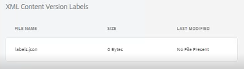

1. Select [!UICONTROL **Cargar**].

1. Elija un archivo como ReviewLabels.json o similar. Los detalles sobre cómo crear un archivo de este tipo se tratan en otro vídeo.

1. Haga clic en [!UICONTROL **Apertura**].

1. Haga clic en [!UICONTROL **Guardar**] en la parte superior izquierda de la pantalla Perfil de carpeta .

1. Haga clic en [!UICONTROL **Cerrar**] en la parte superior derecha.

Ya se han cargado las etiquetas de versión.

## Asignar etiquetas de versión

1. Cargar etiquetas de versión.

1. Haga clic en el [!UICONTROL **Preferencias de usuario**] en la parte superior izquierda del tema actual.

   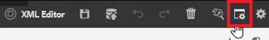

1. Seleccione el mismo perfil de carpeta donde se cargaron previamente las etiquetas de versión.

1. En el cuadro de diálogo Preferencias de usuario, asegúrese de que la ruta base hace referencia a la misma información a la que se ha aplicado el perfil de carpeta.

   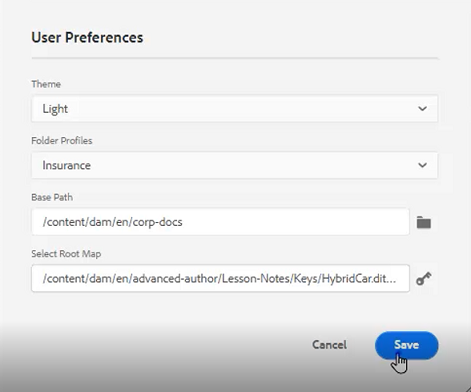

1. Haga clic en [!UICONTROL **Guardar**].

1. Actualice el tema.

1. Añada un comentario y seleccione una etiqueta de versión en la lista desplegable.

   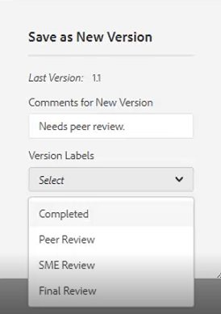

1. Haga clic en [!UICONTROL **Guardar**].

El número de versión se actualiza.

## Ver el historial de versiones y las etiquetas

1. En el panel izquierdo, busque el título del tema actual.

1. Haga clic en el título para abrir el menú contextual.

1. Select [!UICONTROL **Ver en la interfaz de usuario de Assets**].

   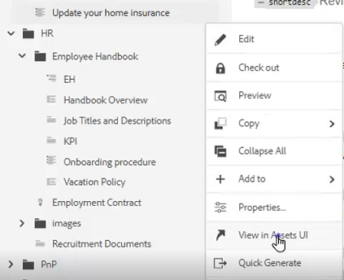

   - El historial de versiones con etiquetas se muestra a la izquierda.

   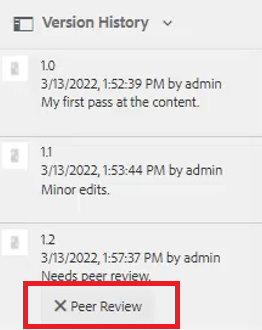

1. Haga clic en una versión para acceder a opciones como **Revertir a esta versión** y **Vista previa de la versión**.

## Crear una plantilla nueva

Existen plantillas para temas y mapas. Los administradores pueden acceder a Plantillas en el panel izquierdo.

1. Haga clic en [!UICONTROL **Plantillas**] en el panel izquierdo.

1. Seleccione Mapa o Tema para abrir el menú contextual asociado.

1. Haga clic en para añadir la nueva plantilla.

   

1. Rellene los campos en el cuadro de diálogo resultante.

Aparece la plantilla shell, que contiene contenido de ejemplo y una estructura de ejemplo.
