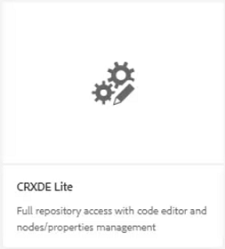
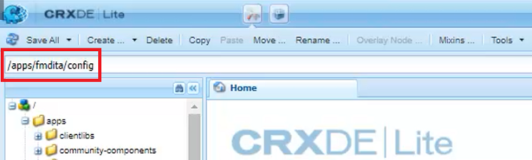
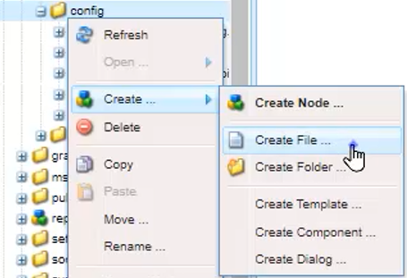
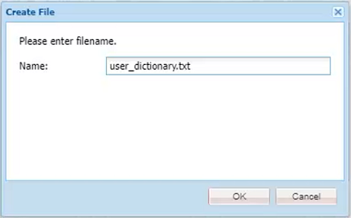
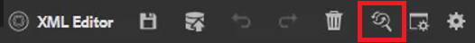
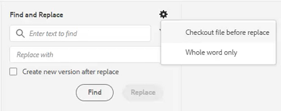
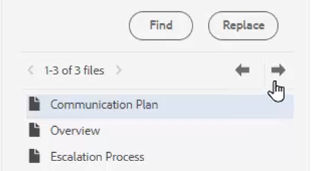

# Revisar ortografía y buscar/reemplazar

El Editor de guías de AEM tiene potentes funciones de revisión ortográfica y de búsqueda y reemplazo.

>[!VIDEO](https://video.tv.adobe.com/v/342768?quality=12&learn=on)

Corregir un error ortográfico

1. Busque un error en un tema abierto, que se muestra con un subrayado rojo.

2. Mantenga pulsada la tecla Ctrl y haga clic en el botón secundario del ratón dentro de la palabra.

3. Elija la ortografía correcta de las sugerencias.

Si no se sugiere la ortografía correcta, siempre puede editarla manualmente.

## Cambiar a AEM revisión ortográfica

Es posible que desee utilizar una herramienta de revisión ortográfica distinta del diccionario predeterminado del navegador.

1. Vaya a **Configuración del editor**.

2. Seleccione el **General** configuración .

   

3. Hay dos opciones:

   - **Revisión ortográfica del explorador** — la configuración predeterminada en la que la revisión ortográfica utiliza el diccionario integrado del navegador.

   - **Revisión de ortografía AEM** — use esto para crear una lista de palabras personalizada usando AEM diccionario personalizado.

4. Choose **Revisión de ortografía AEM**.

5. Haga clic en [!UICONTROL **Guardar**].

Configurar un diccionario personalizado

El administrador puede cambiar la configuración para que el diccionario de AEM reconozca las palabras personalizadas, como los nombres de las empresas.

1. Vaya a la **Herramientas** panel.

2. Iniciar sesión en **CRXDE Lite**.

   

3. Vaya a la **_/apps/fmdita/config nodo_**.

   

4. Cree un nuevo archivo.

   a. Haga clic con el botón derecho en la carpeta de configuración.

   b. Choose **Crear > Crear archivo**.

   

   c. Asigne un nombre al archivo _**user_dictionary.txt**_.

   

   d. Haga clic en [!UICONTROL **OK**].

5. Abra el archivo.

6. Agregue una lista de palabras que desee incluir en el diccionario personalizado.

7. Haga clic en [!UICONTROL **Guardar todo**].

8. Cierre el archivo.

Es posible que los autores tengan que reiniciar la sesión del Editor web para obtener la lista de palabras personalizada actualizada en el AEM del diccionario.

## Buscar y reemplazar en un solo archivo

1. Haga clic en el icono Buscar y reemplazar de la barra de herramientas superior.

   

2. En la barra de herramientas inferior, escriba una palabra o frase.

3. Haga clic en [!UICONTROL **Buscar**].

4. Si es necesario, escriba una palabra para reemplazar la palabra encontrada.

5. Haga clic en [!UICONTROL **Reemplazar**].

## Buscar y reemplazar en el repositorio

1. Vaya a la **Repositorio**.

2. Haga clic en el [!UICONTROL **Buscar y reemplazar**] en la parte inferior izquierda de la pantalla.

3. Haga clic en el [!UICONTROL **Mostrar configuración**] icono.

4. Elija una de las opciones siguientes:

   - **Archivo de cierre de compra antes de reemplazar** — si lo habilita un administrador, el archivo se desprotegerá automáticamente antes de reemplazar los términos de búsqueda.

   - **Sólo palabra completa** — restringe la búsqueda para que devuelva solamente la palabra o frase exacta ingresada.

   

5. Haga clic en el [!UICONTROL **Aplicar filtro**] para seleccionar la ruta en el Repositorio donde desea realizar la búsqueda.

6. Introduzca los términos que desea Buscar y Reemplazar.

7. Si es necesario, seleccione **Crear nueva versión después de reemplazar**.

8. Haga clic en [!UICONTROL **Buscar**].

9. Abra el archivo deseado y utilice las flechas para desplazarse de un resultado encontrado al siguiente.

   
