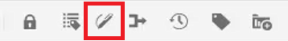

# Control de cambios

Puede realizar un seguimiento de todas las actualizaciones realizadas en un documento activando el modo Control de cambios. Este modo permite al usuario y al equipo capturar todas las inserciones y eliminaciones durante el proceso de revisión del documento.

>[!VIDEO](https://video.tv.adobe.com/v/342763?quality=12&learn=on)

## Uso de la función Control de cambios

1. Alternar el **Control de cambios** icono de la barra de herramientas para activar (o desactivar) la función.

   

1. Realice un cambio en el tema.

   El contenido añadido ahora se muestra en verde con una barra de cambios. El contenido eliminado se muestra en rojo con un tachado.

1. Seleccione el **Cambios seguidos** en la parte derecha para acceder al panel Cambios rastreados.

   

1. Haga clic en [!UICONTROL **Guardar**].

   

1. Cierre el tema.

Otros usuarios ahora pueden abrir el tema y ver las marcas de revisión existentes. Pueden aceptar o rechazar los cambios y agregar los suyos propios.

## Buscar cambios seguidos

La función de búsqueda es útil cuando se rastrean muchos cambios, ya que desplazarse por ellos puede llevar mucho tiempo.

1. Seleccione el **Cambios seguidos** en la parte derecha para acceder al panel Cambios rastreados.

1. Escriba una palabra o frase en el campo Buscar.
La búsqueda devuelve cualquier cambio que coincida con las palabras buscadas.

## Filtrar cambios seguidos

Las marcas de revisión múltiples también se pueden filtrar por inserción, eliminación o revisor.

1. Haga clic en [!UICONTROL **Filtrar**] en la parte inferior del panel Cambios rastreados.

1. Seleccione las casillas de verificación de los filtros que desee.

   

1. Haga clic en [!UICONTROL **Aplicar**].

## Aceptar o rechazar las marcas de revisión

Los revisores y los expertos en la materia pueden aceptar o rechazar los cambios de otros usuarios, ya sea de forma individual o conjunta.

1. Haga clic en [!UICONTROL **Cambios seguidos**] en la parte derecha para acceder al panel Cambios rastreados.

1. Seleccione un cambio específico.

1. Haga clic en [!UICONTROL **Pulgares hacia arriba**] o [!UICONTROL **Pulgares hacia abajo**] icono asociado al cambio para aceptarlo o rechazarlo.

   

   O bien

   Haga clic en [!UICONTROL **Pulgares hacia arriba**] o [!UICONTROL **Pulgares hacia abajo**] sobre la barra de búsqueda para aceptar o rechazar todos los cambios.

   

1. [!UICONTROL **Guardar**] Seleccione el tema.

## Uso de la función Combinar

Cuando se trabaja en un entorno de varios autores, puede resultar difícil realizar el seguimiento de los cambios que han realizado otros autores en un tema o mapa. La función Combinar le proporciona más control no sólo sobre la visualización de los cambios, sino también sobre los cambios que se conservan en la última versión del documento.

1. Abra un tema en el Editor web.

1. Haga clic en [!UICONTROL **Combinar**] en la barra de herramientas.

   

1. En el cuadro de diálogo Combinar, seleccione una versión del archivo con la que desee comparar la versión actual del archivo.

1. En Opciones, elija:

   - **Seguir cambios de la versión seleccionada**: Esta opción muestra todas las actualizaciones de contenido en forma de cambios rastreados. Puede elegir aceptar o rechazar los cambios del documento de uno en uno o todos a la vez.

   - **Revertir a la versión seleccionada**: Esta opción revierte la versión actual del documento a la versión seleccionada. No le proporciona ningún control sobre qué contenido se acepta o rechaza.

1. Haga clic en [!UICONTROL **Listo**].

Si seleccionó la **Opción Rastrear cambios de la versión seleccionada**, todos los cambios de la versión seleccionada aparecerán en la pestaña Cambios del panel derecho.
