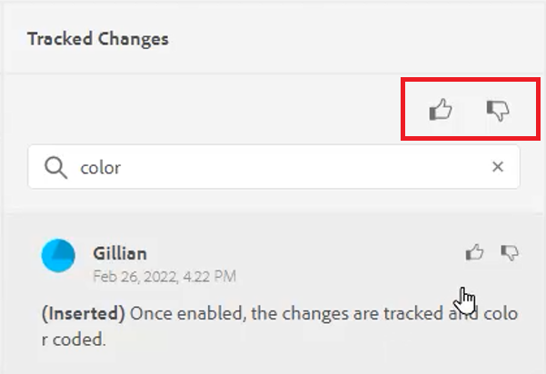

# Seguimiento de cambios

Puede realizar un seguimiento de todas las actualizaciones realizadas en un documento activando el modo Seguimiento de cambios . Este modo permite a usted y a su equipo capturar todas las inserciones y eliminaciones durante el proceso de revisión del documento.

>[!VIDEO](https://video.tv.adobe.com/v/342763?quality=12&learn=on)

## Trabajar con la función de seguimiento de cambios

1. Alternar el **Seguimiento de cambios** icono de la barra de herramientas para activar (o desactivar) la función.

   

2. Realice un cambio en el tema.

   El contenido añadido ahora aparece en verde con una barra de cambios. El contenido eliminado se muestra en rojo con un tachado.

3. Seleccione el **Cambios rastreados** a la derecha para acceder al panel Cambios rastreados .

   

4. Haga clic en [!UICONTROL **Guardar**].

   

5. Cierre el tema.

Otros usuarios ahora pueden abrir el tema y ver los cambios seguidos existentes. Pueden aceptar o rechazar los cambios y agregar los suyos propios.

## Buscar cambios rastreados

La función de búsqueda es útil cuando hay muchos cambios rastreados, ya que desplazarse por ellos puede llevar mucho tiempo.

1. Seleccione el **Cambios rastreados** a la derecha para acceder al panel Cambios rastreados .

2. Escriba una palabra o frase en el campo Buscar .
La búsqueda devuelve cualquier cambio que coincida con las palabras de búsqueda.

## Filtrar cambios rastreados

También se pueden filtrar varios cambios rastreados mediante inserción, eliminación o revisor.

1. Haga clic en el [!UICONTROL **Filtro**] en la parte inferior del panel Cambios rastreados .

2. Seleccione las casillas de verificación de los filtros que desee.

   

3. Haga clic en [!UICONTROL **Aplicar**].

## Aceptar o rechazar cambios rastreados

Los revisores y los expertos en materia de asunto pueden aceptar o rechazar los cambios de otros usuarios, ya sea de forma individual o a la vez.

1. Haga clic en el [!UICONTROL **Cambios rastreados**] a la derecha para acceder al panel Cambios rastreados .

2. Seleccione un cambio específico.

3. Haga clic en el [!UICONTROL **Miniaturas arriba**] o [!UICONTROL **Miniaturas abajo**] asociado con el cambio para aceptarlo o rechazarlo.

   

   O bien

   Haga clic en el [!UICONTROL **Miniaturas arriba**] o [!UICONTROL **Miniaturas abajo**] encima de la barra de búsqueda para aceptar o rechazar todos los cambios.

   

4. [!UICONTROL **Guardar**] el tema.

## Trabajo con la función Combinar

Cuando trabaja en un entorno de varios autores, puede resultar difícil rastrear los cambios que otros autores han realizado en un tema o mapa. La función Combinar permite controlar mejor no solo la visualización de los cambios, sino también los cambios que se conservan en la última versión del documento.

1. Abra un tema en el Editor web.

2. Haga clic en el [!UICONTROL **Combinar**] en la barra de herramientas.

   

3. En el cuadro de diálogo Combinar, seleccione una versión del archivo con el que desea comparar la versión actual del archivo.

4. En Opciones, elija:

   - **Seguimiento de cambios desde la versión seleccionada**: Esta opción muestra todas las actualizaciones de contenido en forma de cambios rastreados. A continuación, puede optar por aceptar o rechazar cambios en el documento de uno en uno o de vez en cuando.

   - **Revertir a la versión seleccionada**: Esta opción revierte la versión actual del documento a la versión seleccionada. No proporciona ningún control sobre qué contenido se acepta o rechaza.

5. Haga clic en [!UICONTROL **Listo**].

Si seleccionó la variable **Opción Rastrear cambios de la versión seleccionada**, todos los cambios de la versión seleccionada aparecen en la ficha Cambios del panel derecho.
