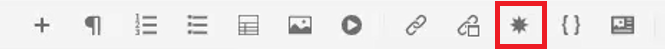
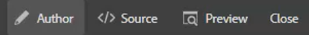

# Preferencias de usuario, configuración del editor y barras de herramientas del editor

El Editor tiene una interfaz altamente configurable. La combinación de Preferencias de usuario, Configuración del editor y Perfiles de carpeta permite personalizar casi todos los aspectos de un entorno de trabajo específico.

>[!VIDEO](https://video.tv.adobe.com/v/342769?quality=12&learn=on)

## Mostrar u ocultar etiquetas de elementos

Las etiquetas son indicaciones visuales que indican los límites de un elemento. Un límite de elemento marca el principio y el final de un elemento. A continuación, puede utilizar estos límites como señal visual para colocar el punto de inserción o seleccionar el texto dentro de un límite.

1. Haga clic en el [!UICONTROL **Alternar vista de etiquetas**] en la barra de herramientas secundaria.

   

   Las etiquetas aparecen dentro del tema. Con la vista de etiquetas puede:

   - Para seleccionar el contenido de un elemento, haga clic en la etiqueta de apertura o cierre.

   - Expanda o contraiga etiquetas haciendo clic en el signo + o - en la etiqueta .

   - Utilice el menú contextual para cortar, copiar o pasar el elemento seleccionado.

   - Arrastre y suelte los elementos seleccionando la etiqueta y soltando el elemento en una ubicación válida.

2. Haga clic en el [!UICONTROL **Alternar vista de etiquetas**] para ocultar las etiquetas.

Las etiquetas desaparecen y permiten centrarse en el texto.

## Bloquear recursos al usarlos

Bloquear (o retirar) un archivo proporciona al usuario acceso de escritura exclusivo en el archivo. Cuando el archivo está desbloqueado (o protegido), los cambios se guardan en la versión actual del archivo.

1. Haga clic en el [!UICONTROL **Bloqueo**] en la barra de herramientas secundaria.

   

   El archivo se ha extraído y aparece un icono de candado junto al nombre del archivo en el Repositorio.

2. Haga clic en el [!UICONTROL **Desbloquear**] icono.

   

El repositorio se actualiza para mostrar que el archivo se ha registrado.

## Insertar caracteres especiales

1. Haga clic en el [!UICONTROL **Insertar caracteres especiales**] en la barra de herramientas secundaria.

   

2. En el cuadro de diálogo Insertar carácter especial, escriba el nombre del carácter en la barra de búsqueda.

   También puede utilizar la lista desplegable Seleccionar categoría para mostrar todos los caracteres de una categoría específica.

3. Seleccione el carácter que desee.

4. Haga clic en [!UICONTROL **Insertar**].

El carácter especial se inserta en el texto.

## Alternar entre los modos Autor, Origen y Vista previa

La barra de herramientas situada en la parte superior derecha de la pantalla permite cambiar entre vistas.

- Select **Autor** para ver la estructura y el contenido mientras trabaja con un tema.

- Select **Fuente** para mostrar el XML subyacente que constituye el tema.

- Select **Vista previa** para mostrar cómo se mostrará un tema cuando lo vea un usuario en su explorador.

## Cambiar el tema con las preferencias de usuario

Puede elegir entre temas claros u oscuros para el editor. Utilizando el tema Luz, las barras de herramientas y los paneles utilizan un fondo gris claro. Utilizando el tema Oscuro, las barras de herramientas y los paneles utilizan un fondo negro. En ambos temas, el área de edición de contenido aparece con un fondo blanco.

1. Haga clic en el [!UICONTROL **Preferencias de usuario**] en la barra de herramientas superior.

   

2. En el cuadro de diálogo Preferencias de usuario, haga clic en el botón [!UICONTROL **Tema**] lista desplegable.

3. Elija entre las opciones disponibles.

   

4. Haga clic en [!UICONTROL **Guardar**].

El Editor se actualiza para mostrar el tema que prefiera.

## Actualizar la ruta base con las preferencias de usuario

Puede actualizar la ruta base para que la vista del repositorio muestre el contenido desde una ubicación específica en cuanto inicie el editor. Esto reduce el tiempo para acceder a los archivos de trabajo.

1. Haga clic en el [!UICONTROL **Preferencias de usuario**] en la barra de herramientas superior.

   

2. En el cuadro de diálogo Preferencias de usuario, haga clic en el botón [!UICONTROL **Carpeta**] junto a la ruta base.

   

3. En el cuadro de diálogo Seleccionar ruta, haga clic en la casilla de verificación situada junto a una carpeta específica.

4. Haga clic en [!UICONTROL **Select**].

La próxima vez que inicie el Editor, el Repositorio mostrará los archivos especificados en la ruta base.

## Asignar un nuevo perfil de carpeta

El perfil global es un valor predeterminado del sistema. Los administradores pueden crear perfiles de carpeta adicionales para elegir.

1. Haga clic en el [!UICONTROL **Preferencias de usuario**] en la barra de herramientas superior.

   

2. En el cuadro de diálogo Preferencias de usuario, haga clic en el botón [!UICONTROL **Perfiles de carpeta**] lista desplegable.

   

3. Elija un perfil de las opciones disponibles.

4. Haga clic en [!UICONTROL **Guardar**].

El nuevo perfil de carpeta ya está asignado. Ha cambiado las opciones de la barra de herramientas, los modos de vista y Condiciones y recortes en el panel izquierdo. También puede cambiar el aspecto visual del contenido en el Editor.

## Cambiar el diccionario con la configuración del editor

La configuración del editor está disponible para los usuarios administrativos. Estas preferencias le permiten configurar un rango de opciones, una de las cuales es el diccionario que el editor usa para la revisión ortográfica.

1. Haga clic en el [!UICONTROL **Configuración del editor**] en la barra de herramientas superior.

   

2. En el cuadro de diálogo Configuración del editor, haga clic en la [!UICONTROL **General**] pestaña .

3. Seleccione el diccionario con el que desea trabajar.

4. Haga clic en [!UICONTROL **Guardar**].

Se actualiza el diccionario. Tenga en cuenta que cambiar a AEM revisión de ortografía le permite usar una lista de palabras personalizada.

## Mostrar y ocultar paneles con la configuración del editor

Una de las funciones que puede personalizar con la Configuración del editor es Paneles. Más específicamente, puede seleccionar qué paneles se muestran u ocultan en el Editor.

1. Haga clic en el [!UICONTROL **Configuración del editor**] en la barra de herramientas superior.

   

2. En el cuadro de diálogo Configuración del editor, haga clic en la [!UICONTROL **Paneles**] pestaña .

3. Cambie los paneles disponibles a Mostrar u Ocultar según sea necesario.

   

4. Haga clic en [!UICONTROL **Guardar**].

El panel izquierdo ahora está configurado para mostrar solo los paneles activados en Mostrar.

## Elementos de nombre y etiqueta en la configuración del editor

La lista de elementos le permite asignar un nombre a un elemento específico y asignarle una etiqueta más descriptiva. El nombre del elemento debe ser uno de los elementos DITA. La etiqueta puede ser cualquier cadena.

1. Haga clic en el [!UICONTROL **Configuración del editor**] en la barra de herramientas superior.

   

2. En el cuadro de diálogo Configuración del editor, haga clic en la [!UICONTROL **Lista de elementos**] pestaña .

3. Escriba un **Nombre del elemento** y **Etiqueta** en los campos correspondientes.

4. Haga clic en el [!UICONTROL **Más**] para añadir más elementos a la lista.

   

5. Haga clic en [!UICONTROL **Guardar**].

Puede ver inmediatamente el cambio a la lista de elementos en las etiquetas existentes en el Editor. También puede verlos en las opciones proporcionadas al agregar un nuevo elemento.

## Atributos de nombre y etiqueta en la configuración del editor

La lista de atributos funciona de forma similar a la lista de elementos. Desde Configuración del editor, puede controlar la lista de atributos y sus nombres para mostrar.

1. Haga clic en el [!UICONTROL **Configuración del editor**] en la barra de herramientas superior.

   

2. En el cuadro de diálogo Configuración del editor, haga clic en la [!UICONTROL **Lista de atributos**] pestaña .

3. Escriba un **Nombre del atributo** y **Etiqueta** en los campos correspondientes.

4. Haga clic en el [!UICONTROL **Más**] para añadir más atributos a la lista.

## Configuración de condiciones en Configuración del editor

La ficha Condición le permite configurar varias propiedades.

1. Haga clic en el [!UICONTROL **Configuración del editor**] en la barra de herramientas superior.

   

2. En el cuadro de diálogo Configuración del editor, haga clic en la [!UICONTROL **Condición**] pestaña .

3. Seleccione las casillas de verificación de las condiciones que desee aplicar.

   

4. Haga clic en [!UICONTROL **Guardar**].

## Crear un perfil de publicación en la configuración del editor

Los perfiles de publicación se pueden utilizar para publicar la base de conocimientos. Por ejemplo, Salesforce utiliza una aplicación configurada con una clave de consumidor y un secreto de consumidor. Esta información se puede utilizar para crear un perfil de publicación de Salesforce.

1. Haga clic en el [!UICONTROL **Configuración del editor**] en la barra de herramientas superior.

   

2. En el cuadro de diálogo Configuración del editor, haga clic en la [!UICONTROL **Perfiles**] pestaña .

3. Haga clic en el [!UICONTROL **Más**] junto a Perfiles.

4. Rellene los campos como sea necesario.

5. Haga clic en [!UICONTROL **Guardar**].

Se ha creado un perfil de publicación.
